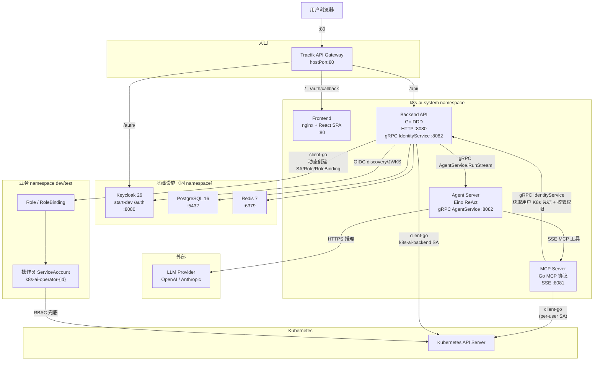

# 架构摘要

完整架构文档已迁移到企业级文档结构中，按受众分层组织。

## 核心架构图

> MCP Server 每次工具调用前通过 Backend 的 gRPC IdentityService 获取操作员 K8s 凭据并校验权限；
> Kubernetes RBAC 作为最终权限边界兜底，即使上层校验缺陷也会拒绝越权访问。

## 文档入口

- [系统架构](docs/architecture/system-architecture.md) — 组件拓扑、Traefik 网关、服务职责、部署拓扑
- [权限模型](docs/architecture/permission-model.md) — 三层权限防线
- [Chat 与 MCP 流程](docs/architecture/chat-mcp-flow.md) — 自然语言到 K8s 的完整链路
- [数据模型](docs/architecture/data-model.md) — 核心表和关系
- [安全设计](docs/security/security-design.md) — 认证、授权、威胁模型
- [开发者文档中心](docs/developer/README.md) — 代码结构与扩展开发

## 核心原则

- Traefik 作为 API 网关，按路径路由外部请求（`/` → Frontend，`/api/` → Backend，`/auth/` → Keycloak），gRPC/SSE 走内部 ClusterIP
- Keycloak 负责认证和平台角色
- PostgreSQL 保存业务权限、LLM 配置、Chat 和审计
- Backend 负责认证、业务授权、Chat 历史、多轮上下文组装和审计
- Backend 与 Agent Server 通过 `proto/agent/v1/agent.proto` 生成的 gRPC 契约通信
- Agent Server 使用 Eino 执行无状态 agent loop，不持久化会话历史
- MCP Server 负责 Kubernetes 工具执行，并再次校验工具权限
- 操作员 Kubernetes 操作必须使用其绑定的 ServiceAccount
- Kubernetes RBAC 是最终权限边界
