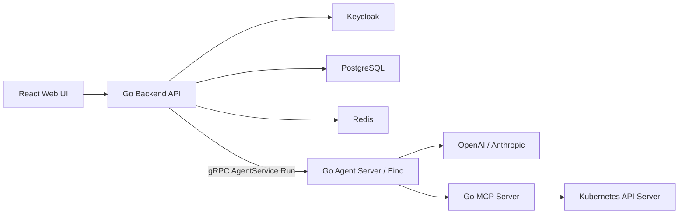

# 架构摘要

完整架构文档已迁移到企业级文档结构中：

- [系统架构](docs/architecture/system-architecture.md)
- [权限模型](docs/architecture/permission-model.md)
- [Chat 与 MCP 流程](docs/architecture/chat-mcp-flow.md)
- [数据模型](docs/architecture/data-model.md)
- [安全设计](docs/security/security-design.md)

## 核心架构图

## 核心原则

- Keycloak 负责认证和平台角色。
- PostgreSQL 保存业务权限、LLM 配置、Chat 和审计。
- Backend 负责认证、业务授权、Chat 历史、多轮上下文组装和审计。
- Backend 与 Agent Server 通过 `proto/agent/v1/agent.proto` 生成的 gRPC 契约通信。
- Agent Server 使用 Eino 执行无状态 agent loop，不持久化会话历史。
- MCP Server 负责 Kubernetes 工具执行，并再次校验工具权限。
- 操作员 Kubernetes 操作必须使用其绑定的 ServiceAccount。
- Kubernetes RBAC 是最终权限边界。
