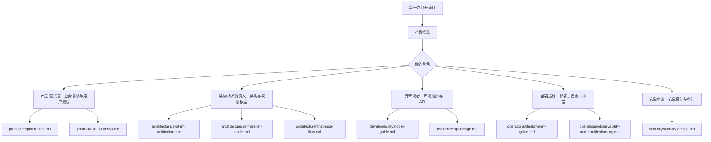

# 文档中心

本文档中心按读者角色和关注层次组织，避免把产品、架构、开发、运维、安全信息混在同一篇文档里。

## 阅读路径

## 快速了解项目

- [产品概览](product/overview.md)：项目背景、目标、能力边界、MVP 演示闭环。
- [业务需求](product/requirements.md)：角色、功能需求、非功能需求和验收标准。
- [用户流程](product/user-journeys.md)：管理员和操作员的核心业务流程。

## 架构与设计

- [系统架构](architecture/system-architecture.md)：组件拓扑、Backend/Agent/MCP 调用链路、部署拓扑。
- [权限模型](architecture/permission-model.md)：Keycloak、业务权限、Kubernetes RBAC 三层授权。
- [Chat 与 MCP 流程](architecture/chat-mcp-flow.md)：自然语言、Eino Agent、gRPC、LLM Tool Calling、MCP 工具执行时序。
- [数据模型](architecture/data-model.md)：核心表、关系和数据边界。

## 二次开发

- [二开指南](developer/developer-guide.md)：代码结构、模块边界、开发规范、扩展方式。
- [API 设计](reference/api-design.md)：Backend API 分组、请求响应示例。
- [术语表](reference/glossary.md)：项目关键概念。

## 部署运维

- [部署指南](operations/deployment-guide.md)：Kind、Helm、本地 tar 镜像、镜像仓库部署。
- [日志、审计与排错](operations/observability-and-troubleshooting.md)：日志规范、审计事件、排错路径。
- [公有云 Kubernetes 测试计划](operations/public-cloud-test-plan.md)：后续在公有云集群部署依赖、自有服务和端到端验证。

## 安全

- [安全设计](security/security-design.md)：认证、授权、敏感信息、LLM 安全和审计。

## 根目录文档

- [README](../README.md)：项目首页和快速命令。
- [ARCHITECTURE](../ARCHITECTURE.md)：架构摘要和入口。
- [AGENTS](../AGENTS.md)：项目协作规则。
- [AI_PROMPTS](../AI_PROMPTS.md)：AI 协同研发报告。
