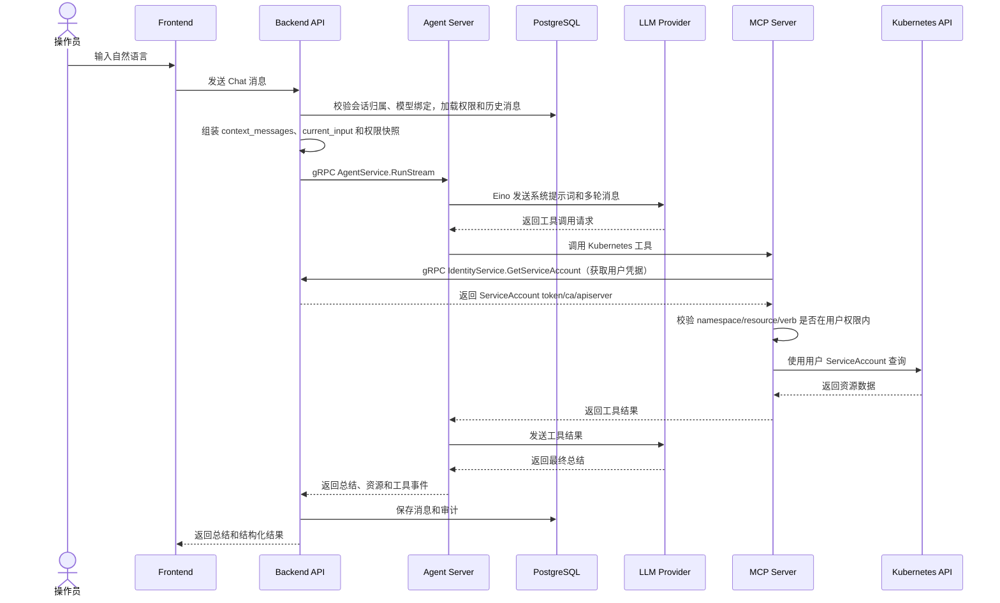
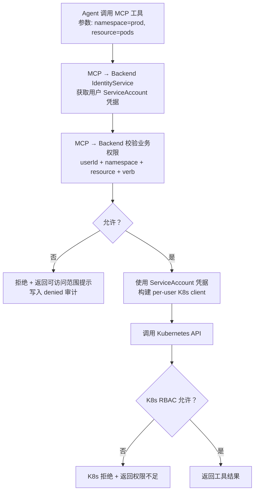
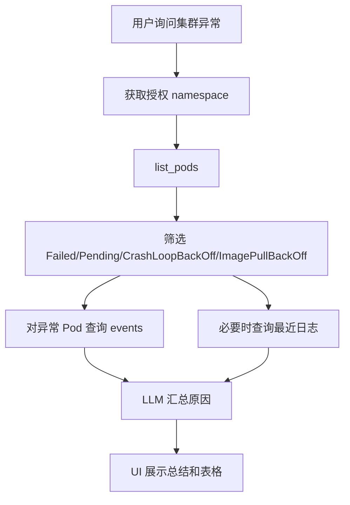

# Chat 与 MCP 流程

这篇文档面向想理解自然语言到 K8s 操作完整链路的架构师和开发者，说明从操作员输入到 Kubernetes API 调用的每一步。

## 1. 流程概览



## 2. MCP Server 与 Backend 的身份/权限交互

MCP Server 每次工具调用需要两步与 Backend 交互：

### 2.1 获取用户 K8s 凭据（IdentityService）

```
MCP Server ──gRPC──▶ Backend API (IdentityService.GetServiceAccount)
                     │
                     ├── 查询 service_account_bindings 表
                     ├── 查询 service_account_tokens 表（解密 token）
                     └── 返回: ServiceAccount name, namespace, token, ca_cert, api_server
```

MCP Server 拿到凭据后构建 per-user `client-go` Kubernetes client，确保每个操作员的 K8s 请求使用自己的 ServiceAccount。

### 2.2 校验业务权限

```
MCP Server ──gRPC──▶ Backend API (IdentityService)
                     │
                     ├── 传入: userId + namespace + apiGroup + resource + verb
                     ├── 查询 k8s_permissions 表
                     └── 返回: allowed / denied + 可访问范围建议
```

### 2.3 两层校验的协作关系



这种设计确保即使业务权限校验（MCP → Backend）有缺陷，Kubernetes RBAC 仍会在 API Server 层做最终拦截。

## 3. 系统提示词内容

Agent Server 通过 Eino 构造 LLM prompt 时必须包含 Backend 传入的最小必要上下文：

- 当前用户身份和角色
- 当前用户允许访问的 namespace
- 每个 namespace 下允许访问的 resource 和 verb
- 最近多轮 `context_messages`
- 当前输入 `current_input`
- 内置 MCP 工具能力说明
- 禁止越权访问说明
- 输出格式要求：自然语言总结 + 结构化资源结果

## 4. MCP 工具映射

| 工具 | Kubernetes 资源 | verb | 用途 |
|------|-----------------|------|------|
| `list_namespaces` | 业务权限摘要 | read | 返回当前用户可见 namespace |
| `list_pods` | `pods` | `list` | 查询 Pod 列表和异常状态 |
| `get_pod` | `pods` | `get` | 查询 Pod 详情 |
| `get_pod_logs` | `pods/log` | `get` | 查询 Pod 日志 |
| `list_events` | `events` | `list` | 查询事件 |
| `get_pod_events` | `events` | `get` | 查询特定 Pod 的事件 |
| `list_deployments` | `deployments.apps` | `list` | 查询 Deployment |
| `restart_deployment` | `deployments.apps` | `patch` | 通过 patch annotation 触发滚动重启 |

## 5. 异常 Pod 巡检细节



## 6. 错误处理

- LLM Provider 不可用：返回模型不可用提示，写入错误审计
- Chat 会话不属于当前用户：拒绝请求，写入错误审计
- `modelId` 未绑定到当前用户：拒绝请求，写入错误审计
- MCP → Backend 身份查询失败：返回"无法获取操作员凭据"
- MCP → Backend 权限拒绝：拒绝调用，返回可访问范围提示，写入 denied 审计
- Kubernetes RBAC 拒绝：返回权限不足提示，写入 Kubernetes denied 审计
- MCP Server 不可用：返回工具服务不可用提示，建议稍后重试
- Pod 日志过大：只读取 tail 行数，并在响应中说明截断

## 7. gRPC 契约

系统内部两条 gRPC 通道：

| 契约 | 方向 | 方法 | 用途 |
|------|------|------|------|
| `proto/agent/v1/agent.proto` | Backend → Agent Server | `RunStream` (server-streaming) | Backend 发起 Chat，Agent Server 流式返回事件 |
| `proto/identity/v1/identity.proto` | MCP Server → Backend | `GetServiceAccount` (unary) | MCP Server 获取操作员 K8s 凭据和校验业务权限 |

## 8. 开发扩展

新增 MCP 工具时需要同步完成：

1. 在 `mcp-server/internal/handler/` 实现工具处理器
2. 在 MCP Server 路由中注册工具端点
3. 在 Backend 权限映射中登记工具对应的 `namespace/resource/verb`
4. 在 Backend IdentityService 中补全新工具的权限校验逻辑
5. 更新本文档的工具映射表
6. 更新 [API 设计](../reference/api-design.md)
7. 增加单元测试，覆盖正常调用和越权拒绝

详见 [扩展开发指南](../developer/extension-guide.md)。
