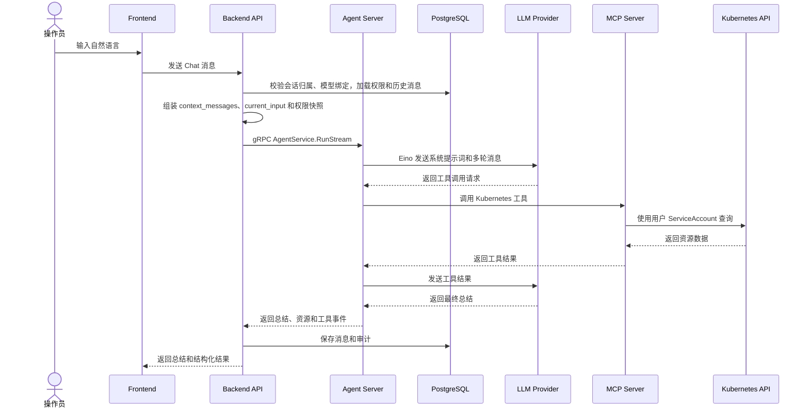
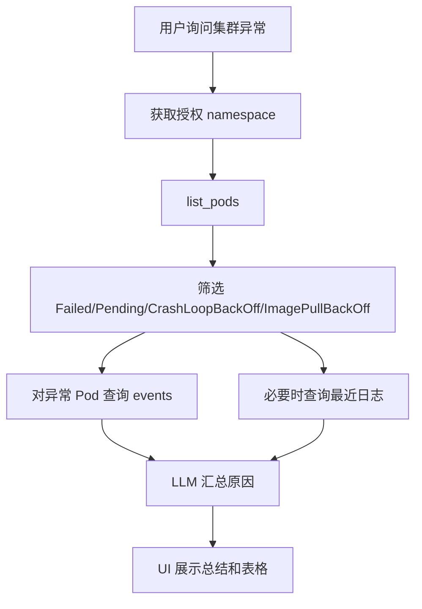

# Chat 与 MCP 流程

## 流程概览

## 系统提示词内容

Agent Server 通过 Eino 构造 LLM prompt 时必须包含 Backend 传入的最小必要上下文：

- 当前用户身份和角色。
- 当前用户允许访问的 namespace。
- 每个 namespace 下允许访问的 resource 和 verb。
- 最近多轮 `context_messages`。
- 当前输入 `current_input`。
- 内置 MCP 工具能力说明。
- 禁止越权访问说明。
- 输出格式要求：自然语言总结 + 结构化资源结果。

## MCP 工具映射

| 工具 | Kubernetes 资源 | verb | 用途 |
| --- | --- | --- | --- |
| `list_namespaces` | 业务权限摘要 | read | 返回当前用户可见 namespace |
| `list_pods` | `pods` | `list` | 查询 Pod 列表和异常状态 |
| `get_pod` | `pods` | `get` | 查询 Pod 详情 |
| `get_pod_logs` | `pods/log` | `get` | 查询 Pod 日志 |
| `list_events` | `events` | `list` | 查询事件 |
| `list_deployments` | `deployments.apps` | `list` | 查询 Deployment |
| `restart_deployment` | `deployments.apps` | `patch` | 通过 patch annotation 触发滚动重启 |

## 异常 Pod 巡检细节

## 错误处理

- LLM Provider 不可用：返回模型不可用提示，写入错误审计。
- Chat 会话不属于当前用户：拒绝请求，写入错误审计。
- `modelId` 未绑定到当前用户：拒绝请求，写入错误审计。
- 工具调用越权：拒绝调用，返回可访问范围提示，写入 denied 审计。
- Kubernetes RBAC 拒绝：返回权限不足提示，写入 Kubernetes denied 审计。
- MCP Server 不可用：返回工具服务不可用提示，建议稍后重试。
- Pod 日志过大：只读取 tail 行数，并在响应中说明截断。

## 当前实现状态

当前各组件已实现以下流程支撑：

- **agent-server**：基于 Eino ADK ChatModelAgent 实现 ReAct loop，通过 MCP SSE client 发现并调用内置工具，每次请求注入 `user_id` 实现 per-user 工具隔离。内置 Skills 系统支持渐进式能力披露（通过 `SKILLS_DIR` 环境变量配置）。对外暴露 server-streaming gRPC `RunStream` 接口。
- **mcp-server**：基于 `mark3labs/mcp-go` 实现标准 MCP 协议，通过 SSE transport 暴露 8 个工具（`list_namespaces`、`list_pods`、`get_pod`、`get_pod_logs`、`list_events`、`get_pod_events`、`list_deployments`、`restart_deployment`）。每次工具调用通过 IdentityService gRPC 获取操作员的 ServiceAccount，实现 per-user K8s 客户端隔离。
- **backend**：通过 gRPC AgentService client 调用 `RunStream`，并将 SSE 事件流中继到前端。同时维护 Chat Session/Message、权限快照和审计日志。
- **proto**：`agent/v1/agent.proto` 定义 `RunStream` server-streaming RPC 和 13 种 `StreamEvent` 消息类型，`identity/v1/identity.proto` 定义 `GetServiceAccount` unary RPC。

尚未实现：

- Keycloak JWT audience 校验
- PostgreSQL migration 版本管理（当前仅有 schema 初始化）
- Redis 业务缓存和流式状态
- Frontend 真实 API 集成
- Umbrella Helm Chart
