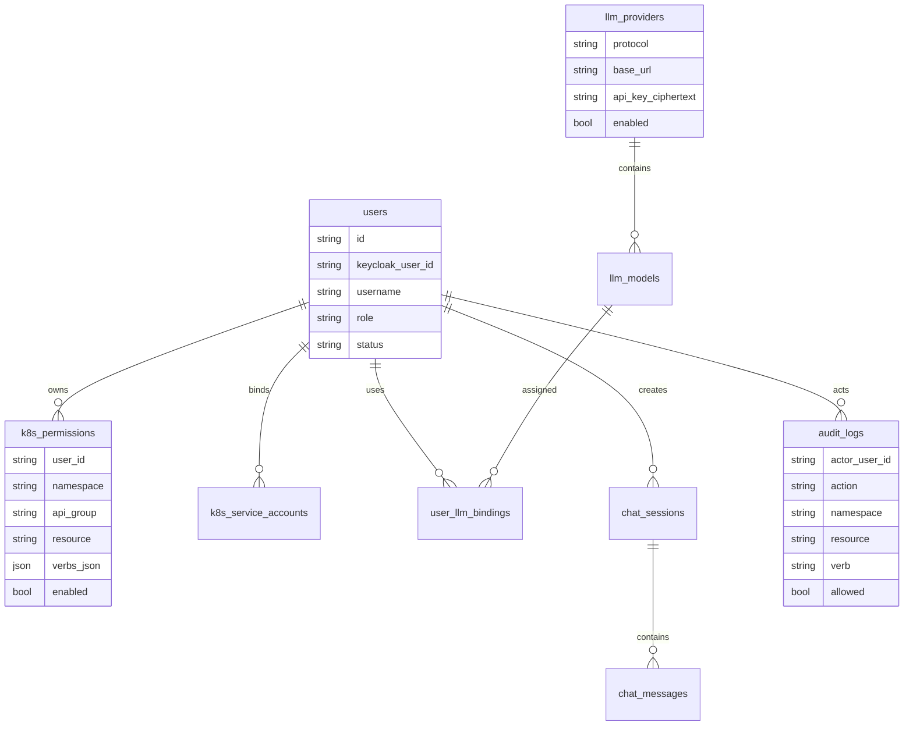

# 数据模型

## Chat、Agent 与资源引用

Agent Server 不持久化 Chat 数据。Backend 需要保存 Chat Session、Chat Message、工具事件和结构化资源结果，并在下一轮请求中组装：

- `messages`：最近对话窗口。
- `runtimeContext.allowedNamespaces`：当前权限摘要。
- `runtimeContext.recentResources`：最近几轮返回的轻量资源引用，例如 Pod namespace/name/status。
- `tools`：本轮允许调用的工具 allowlist。

权限变化后，Backend 必须重新筛选历史上下文和最近资源引用。

## 数据关系图



## 表设计

### users

保存 Keycloak 用户和平台用户的映射。

```text
id
keycloak_user_id
username
display_name
email
role
status
created_by
created_at
updated_at
```

### k8s_service_accounts

保存操作员和 Kubernetes ServiceAccount 的绑定关系。

```text
id
user_id
namespace
service_account_name
token_secret_name
status
created_at
updated_at
```

### k8s_permissions

保存业务权限，并作为生成 Role/RoleBinding 的来源。

```text
id
user_id
namespace
api_group
resource
verbs_json
role_name
role_binding_name
enabled
created_by
created_at
updated_at
```

### llm_providers

保存 LLM Provider 配置。`api_key_ciphertext` 必须加密保存。

```text
id
name
protocol
base_url
api_key_ciphertext
enabled
created_by
created_at
updated_at
```

### llm_models

保存 Provider 下可使用模型。

```text
id
provider_id
model_name
display_name
supports_tools
supports_streaming
enabled
created_at
updated_at
```

### user_llm_bindings

保存操作员可使用模型和默认模型。

```text
id
user_id
model_id
is_default
created_by
created_at
```

### chat_sessions

保存 Chat 会话元数据。

```text
id
user_id
model_id
title
status
created_at
updated_at
```

### chat_messages

保存用户消息、助手消息和工具消息。工具结果应保存摘要，不保存大体积日志全文。

```text
id
session_id
role
content
tool_name
tool_args_json
tool_result_json
created_at
```

### audit_logs

保存可审计事件。请求和响应必须脱敏。

```text
id
actor_user_id
action
target_type
target_id
namespace
resource
verb
allowed
reason
request_json
response_json
created_at
```

## 数据安全规则

- 不保存 ServiceAccount 明文 token。
- 不保存 LLM API Key 明文。
- 不保存 Kubernetes Secret 明文。
- Chat 工具结果中的日志需要限制大小。
- 审计日志保存脱敏后的请求和响应。

## 当前实现状态

当前代码中已经有两种 Store 实现：

- `backend/internal/store.MemoryStore`：默认内存实现，用于快速启动和单元测试。
- `backend/internal/store.PostgresStore`：真实 PostgreSQL 实现，支持 schema 初始化、Demo 用户初始化、用户/权限/LLM/审计持久化。

Backend 通过 `STORE_DRIVER` 选择实现：

```text
STORE_DRIVER=memory
STORE_DRIVER=postgres
```

后续需要补充生产级 migration 版本管理，但 HTTP API 行为应保持不变。
