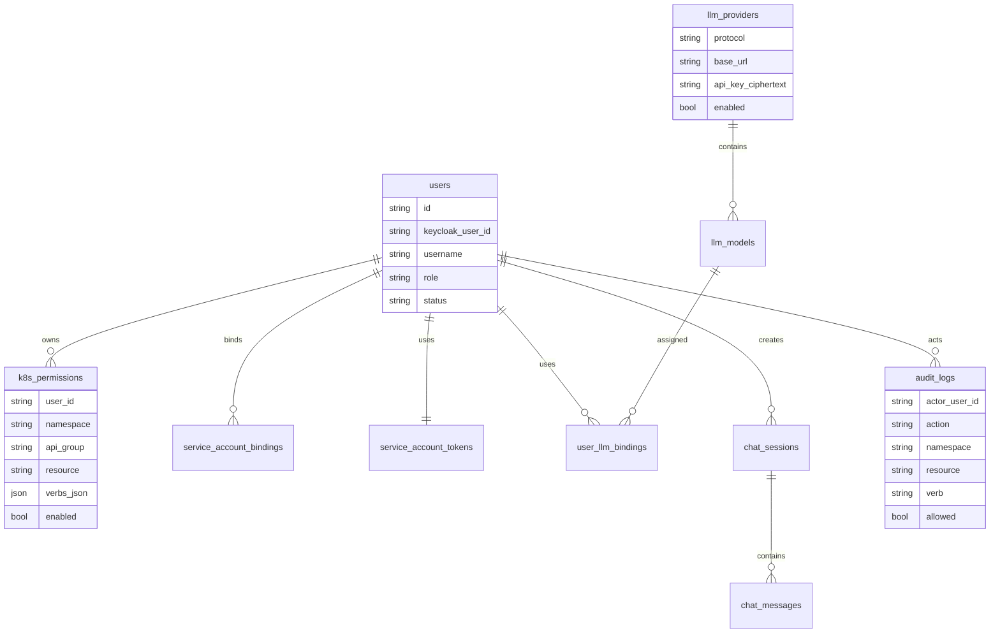

# 数据模型

## Chat、Agent 与资源引用

Agent Server 不持久化 Chat 数据。Backend 需要保存 Chat Session、Chat Message、工具事件和结构化资源结果，并在下一轮请求中组装：

- `context_messages`：最近对话窗口，不包含当前输入。
- `current_input`：当前用户本轮输入。
- `permissions`：当前用户权限快照。Agent Server 只把它作为提示上下文，实际工具能力来自内置 MCP Server 工具发现和 MCP Server 的再次权限校验。

权限变化后，Backend 必须重新筛选历史上下文和最近资源引用。

## 数据关系图



## 表设计

### users

保存 Keycloak 用户和平台用户的映射。

```text
id
keycloak_user_id
username
display_name
email
role
status
created_by
created_at
updated_at
```

### service_account_bindings

保存操作员和 Kubernetes ServiceAccount 的绑定关系。

```text
id
user_id
namespace
service_account
status
created_at
updated_at
```

### service_account_tokens

保存 IdentityService 返回给 MCP Server 的用户级 Kubernetes ServiceAccount 运行时凭据。`token_ciphertext` 存储加密后的 token；开发环境未配置 `ENCRYPTION_KEY` 时会退回明文存储，仅允许本地调试使用。

```text
user_id
service_account
namespace
token_ciphertext
ca_cert
api_server
created_at
updated_at
```

### k8s_permissions

保存业务权限，并作为生成 Role/RoleBinding 的来源。

```text
id
user_id
namespace
api_group
resource
verbs_json
role_name
role_binding_name
enabled
created_by
created_at
updated_at
```

### llm_providers

保存 LLM Provider 配置。`api_key_ciphertext` 必须加密保存。

```text
id
name
protocol
base_url
api_key_ciphertext
enabled
created_by
created_at
updated_at
```

### llm_models

保存 Provider 下可使用模型。

```text
id
provider_id
model_name
display_name
supports_tools
supports_streaming
enabled
created_at
updated_at
```

### user_llm_bindings

保存操作员可使用模型和默认模型。

```text
id
user_id
model_id
is_default
created_by
created_at
```

### chat_sessions

保存 Chat 会话元数据。

```text
id
user_id
model_id
title
status
created_at
updated_at
```

### chat_messages

保存用户消息、助手消息和工具消息。工具结果应保存摘要，不保存大体积日志全文。

```text
id
session_id
role
content
tool_name
tool_args_json
tool_result_json
created_at
```

### audit_logs

保存可审计事件。请求和响应必须脱敏。

```text
id
actor_user_id
action
target_type
target_id
namespace
resource
verb
allowed
reason
request_json
response_json
created_at
```

## 数据安全规则

- 不保存 ServiceAccount 明文 token。
- 不保存 LLM API Key 明文。
- 不保存 Kubernetes Secret 明文。
- Chat 工具结果中的日志需要限制大小。
- 审计日志保存脱敏后的请求和响应。

## 当前实现状态

当前 Backend 使用 `backend/internal/infra/postgres.DataStore` 作为 PostgreSQL 仓储实现，并通过 GORM AutoMigrate 自动建表。

已实现的表/实体：

- `users`：平台用户映射（含 `username`、`display_name`、`email`、`role`、`status`）
- `k8s_permissions`：业务权限（`namespace + apiGroup + resource + verbs_json`）
- `service_account_bindings`：操作员与 K8s ServiceAccount 绑定
- `service_account_tokens`：用户级 ServiceAccount 运行时凭据，`token_ciphertext` 通过 `ENCRYPTION_KEY` 派生密钥加密
- `llm_providers`：LLM Provider 配置（`protocol`、`base_url`、`api_key_ciphertext`）
- `llm_models`：Provider 下可用模型（含 `supports_tools`、`supports_streaming` 标志）
- `user_llm_bindings`：用户与模型绑定（含 `is_default`）
- `chat_sessions`：Chat 会话元数据
- `chat_messages`：用户/助手/工具消息（含 `tool_name`、`tool_args_json`、`tool_result_json`）
- `audit_logs`：审计日志（含脱敏请求/响应）

尚未实现：

- 版本化 migration 脚本（当前依赖 GORM AutoMigrate）
- Redis 业务缓存（会话缓存、权限缓存）和流式状态存储
