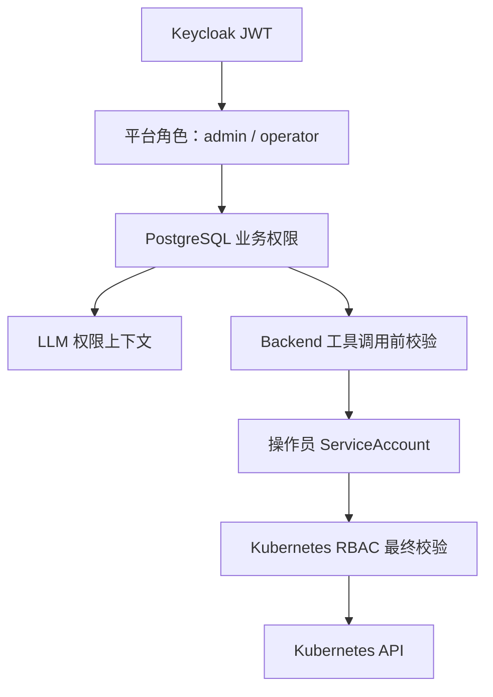
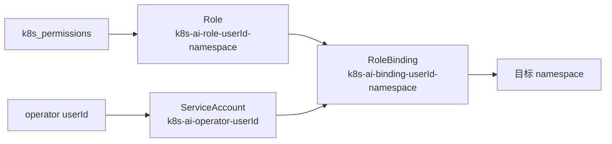
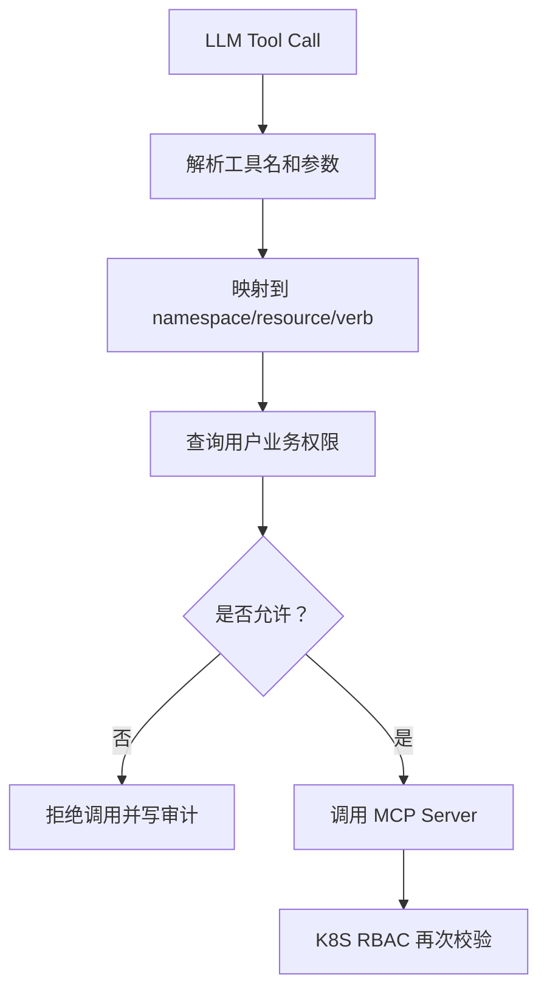

# 权限模型

## Agent 引入后的授权边界

引入 Agent Server 后，权限边界分为三层：

- Backend API：读取当前用户真实业务权限，生成工具 allowlist，并决定哪些历史消息和资源引用可以进入 `runtimeContext`。
- Agent Server：只消费 Backend 传入的上下文和工具 allowlist，不保存权限，不扩大工具范围。
- MCP Server：每次工具执行前再次校验 namespace、apiGroup、resource、verb，并使用当前用户绑定的 ServiceAccount 访问 Kubernetes。

`runtimeContext.recentResources` 只用于多轮指代理解，不是授权凭证。

## 总体模型

系统权限分为三层：身份认证、业务授权、Kubernetes RBAC。



## 平台角色

Keycloak 只维护平台角色：

- `admin`：访问管理后台，管理用户、权限、LLM、审计。
- `operator`：访问操作员 Chat 页面。

Kubernetes 资源权限不放入 Keycloak claims，避免 claims 过大、难以动态更新、难以和 Kubernetes RBAC 保持一致。

## 业务权限

业务权限保存在 PostgreSQL，粒度为：

```text
namespace + apiGroup + resource + verbs
```

示例：

```text
namespace=dev apiGroup= resource=pods verbs=get,list,watch
namespace=dev apiGroup=apps resource=deployments verbs=get,list,watch,patch
```

## Kubernetes RBAC

管理员给操作员分配权限后，Backend 动态创建：



当前代码已实现 `backend/internal/k8s.RBACManager`，它通过 `client-go` 创建或更新以下对象：

- ServiceAccount
- Role
- RoleBinding

RBAC Manager 会给对象增加托管标签：

```text
app.kubernetes.io/name=k8s-ai-ops
app.kubernetes.io/managed-by=k8s-ai-ops-backend
```

管理员更新权限时，HTTP 权限更新流程会先保存业务权限，再在 `K8S_RBAC_SYNC_ENABLED=true` 时调用 RBAC Manager，将业务权限按 namespace 分组同步到 Kubernetes。同步失败时接口返回 `K8S_RBAC_APPLY_FAILED`，并写入失败审计。

Helm Chart 不默认授予 Backend 集群级权限。部署时需要通过 `rbac.managedNamespaces` 显式声明 Backend 可以管理哪些 namespace，Chart 会在这些 namespace 内创建 Role 和 RoleBinding。

## 工具调用授权

LLM 生成的工具调用必须经过 Backend 校验：



## 为什么不能只依赖 ServiceAccount

只依赖 Kubernetes RBAC 虽然安全，但用户体验和审计不够好：

- LLM 可能生成越权参数，直接让 Kubernetes 报错会让用户难以理解。
- Backend 无法在调用前给出清晰提示，例如“你只能访问 dev/test”。
- 业务侧无法提前记录越权意图和拒绝原因。

因此系统必须同时使用：

- prompt 中限制能力范围；
- Backend 工具调用前校验；
- Kubernetes RBAC 最终兜底。
