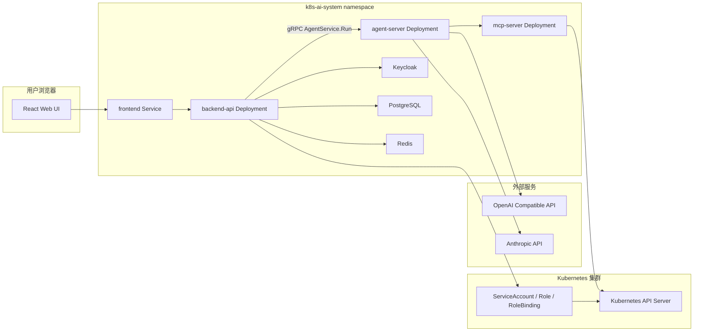
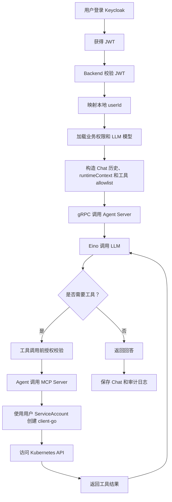
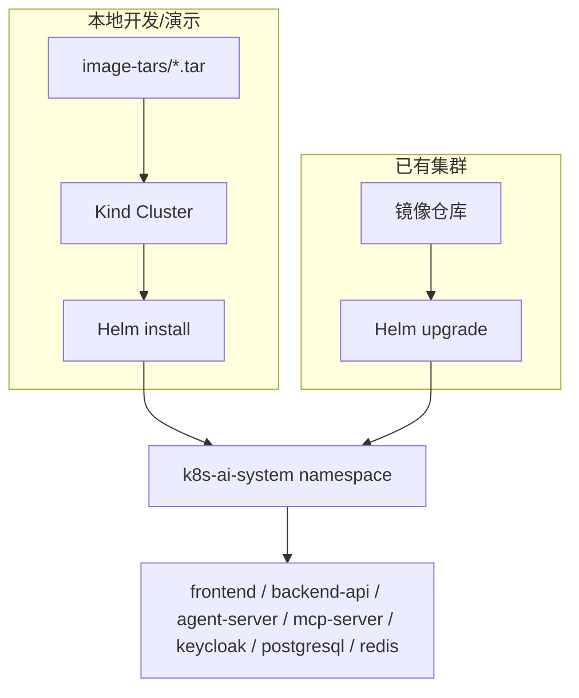
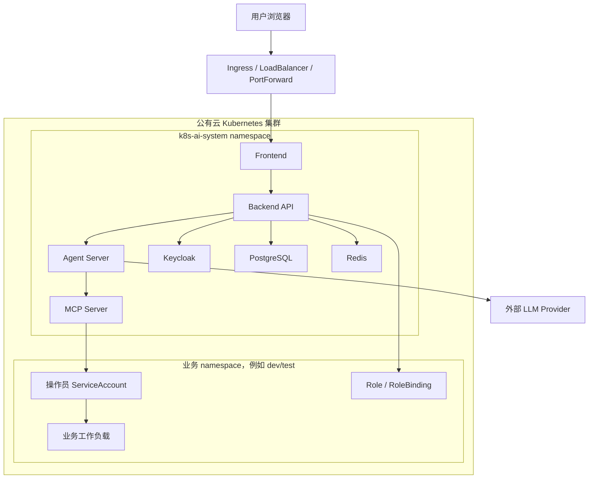

# 系统架构

## 组件视图

## 运行时调用链

## 部署拓扑

## 公有云部署拓扑

公有云测试时，PostgreSQL、Redis、Keycloak 可以先使用 Helm Chart 内置部署；如果云上已有托管服务或统一身份源，可以通过 values 关闭内置组件并接入外部地址。

## 服务职责

| 服务 | 职责 | 不负责 |
| --- | --- | --- |
| Frontend | 页面展示、登录跳转、调用 Backend API | 不保存权限，不直接调用 K8S |
| Backend API | 认证校验、业务授权、用户管理、LLM 管理、Chat 编排、审计 | 不直接暴露 K8S 凭据给前端 |
| Agent Server | 使用 Eino 执行无状态 agent loop，通过 gRPC 接收 Backend 上下文 | 不保存 Chat 历史，不决定业务权限 |
| MCP Server | 将 Kubernetes 能力封装为工具 | 不决定业务权限，不管理用户 |
| Keycloak | 身份认证和平台角色 | 不保存 K8S 资源权限 |
| PostgreSQL | 持久化业务状态 | 不保存明文 token 和 API Key |
| Redis | 短期缓存和流式状态 | 不作为最终数据源 |

## 当前代码实现状态

- Backend 已支持 MemoryStore 和 PostgresStore。
- Backend 已支持 Redis 连通性检查和基础 `PING/SET/GET`。
- Backend 已实现 Kubernetes RBAC Manager，可通过 `client-go` 创建/更新 ServiceAccount、Role、RoleBinding。
- HTTP 权限更新接口已支持在 `K8S_RBAC_SYNC_ENABLED=true` 时调用 RBAC Manager，并按 namespace 分组同步 ServiceAccount、Role、RoleBinding。
- Helm Chart 已改为 namespace 级 RBAC 授权：通过 `rbac.managedNamespaces` 指定 Backend 可管理的目标 namespace，不默认创建 ClusterRole。

## 架构约束

- 操作员只允许 namespace 级权限。
- LLM 不直接访问 Kubernetes。
- MCP Server 只接受 Backend 调用。
- Backend 工具调用前必须做授权校验。
- Kubernetes RBAC 是最终权限边界。
