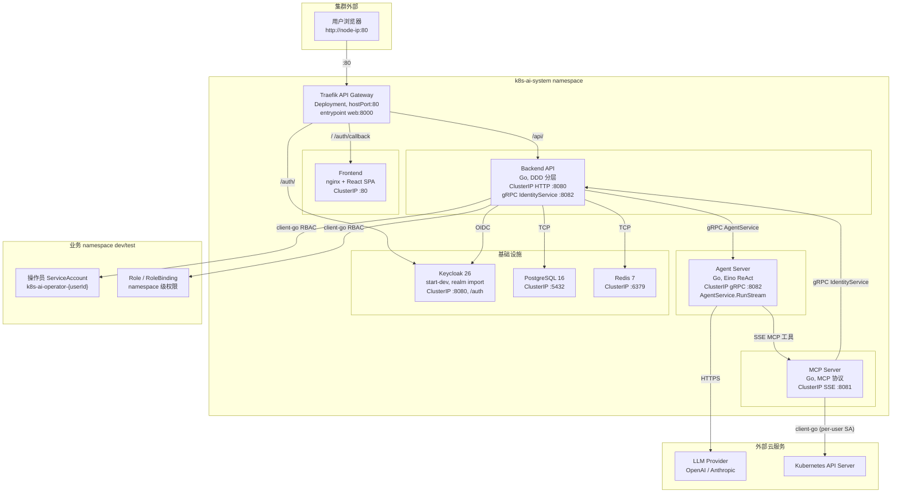
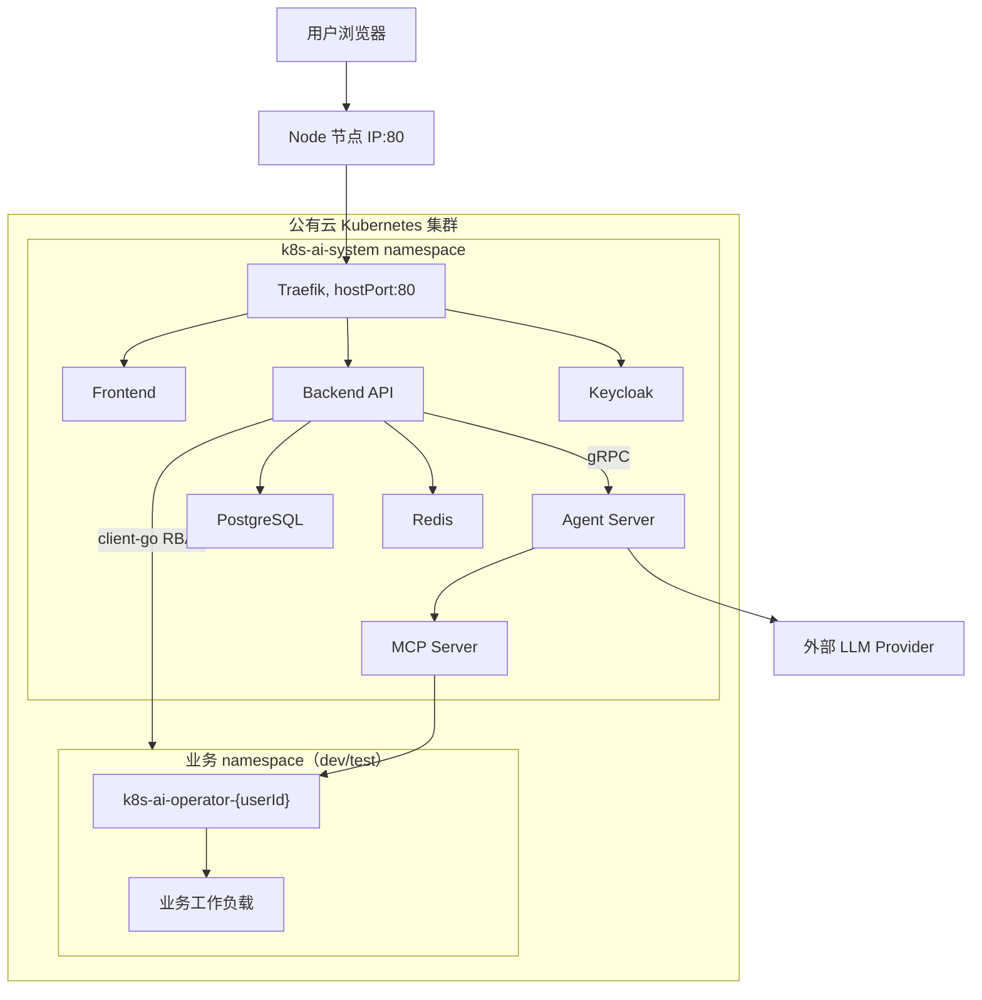

# 系统架构

这篇文档面向想理解 k8s-agent 整体架构的技术负责人和开发者，说明 Kubernetes 集群内的部署拓扑、组件职责和通信链路。

## 1. 部署拓扑总览

所有组件部署在 `k8s-ai-system` namespace 中。外部流量通过 Traefik API 网关接入，gRPC 和 SSE 走内部 ClusterIP。



## 2. 组件清单

### 2.1 自有服务（4 个）

| 组件 | Kind | 副本 | 端口 | 镜像 | 说明 |
|------|------|------|------|------|------|
| **Frontend** | Deployment + ClusterIP | 1 | 80 | `k8s-ai-frontend:{tag}` | nginx 提供 React SPA 静态资源 |
| **Backend API** | Deployment + ClusterIP | 1 | 8080 (HTTP), 8082 (gRPC) | `k8s-ai-backend:{tag}` | 认证授权、用户管理、权限管理、Chat 编排、审计，同时运行 gRPC IdentityService server |
| **Agent Server** | Deployment + ClusterIP | 1 | 8082 (gRPC) | `k8s-ai-agent-server:{tag}` | Eino ADK ChatModelAgent ReAct loop，AgentService.RunStream server-streaming |
| **MCP Server** | Deployment + ClusterIP | 1 | 8081 (SSE) | `k8s-ai-mcp-server:{tag}` | 8 个 K8s 运维工具，per-user K8s client，工具执行前权限校验 |

### 2.2 基础设施（3 个）

| 组件 | Kind | 镜像 | 端口 | 说明 |
|------|------|------|------|------|
| **Keycloak** | Deployment + ClusterIP | `keycloak:26.0.7` | 8080 | start-dev 模式，`/auth` 相对路径，ConfigMap 导入 realm（PKCE OIDC client，admin/operator 角色，预置 admin 用户） |
| **PostgreSQL** | Deployment + ClusterIP | `postgres:16-alpine` | 5432 | 数据库 `k8s_ai`，用户 `k8s_ai`，GORM AutoMigrate 自动建表 |
| **Redis** | Deployment + ClusterIP | `redis:7-alpine` | 6379 | 短期缓存和流式状态 |

### 2.3 API 网关

| 组件 | Kind | 镜像 | 端口 | 说明 |
|------|------|------|------|------|
| **Traefik** | Deployment + ClusterIP | `traefik:v3.6.13` | 8000 (web), 8080 (traefik) | Kubernetes CRD Provider，`hostPort:80` 映射 web entrypoint，Recreate 更新策略 |

## 3. 服务间通信矩阵

```
外部请求流（经过 Traefik）:
  浏览器 → Traefik:80 → /                → Frontend:80
  浏览器 → Traefik:80 → /api/*           → Backend API:8080
  浏览器 → Traefik:80 → /auth/*          → Keycloak:8080
  浏览器 → Traefik:80 → /auth/callback   → Frontend:80

内部通信流（ClusterIP，不经过 Traefik）:
  Backend API  → agent-server:8082     (gRPC AgentService.RunStream)
  Backend API  → postgresql:5432        (PostgreSQL TCP)
  Backend API  → redis:6379             (Redis TCP)
  Backend API  → keycloak:8080          (OIDC discovery/JWKS)
  Agent Server → mcp-server:8081/sse    (MCP SSE)
  Agent Server → 外部 LLM API           (HTTPS)
  MCP Server   → backend-api:8082       (gRPC IdentityService.GetServiceAccount)
  MCP Server   → Kubernetes API Server  (client-go, per-user ServiceAccount)
  Backend API  → Kubernetes API Server  (client-go, k8s-ai-backend SA)
```

注意：Backend API 的 gRPC 端口 8082（IdentityService server）和 Agent Server 的 gRPC 端口 8082（AgentService server）属于不同 Pod/Service，互不冲突。

## 4. Traefik 路由规则

| IngressRoute | 路径 | 优先级 | 目标 Service | 说明 |
|-------------|------|--------|-------------|------|
| `frontend` | `/auth/callback` | 300 | frontend:80 | OIDC PKCE 回调，最高优先级 |
| `keycloak` | `/auth/` | 200 | keycloak:8080 | Keycloak 管理界面和认证端点 |
| `backend-api` | `/api/` | 100 | backend-api:8080 | 所有业务 API 请求 |
| `frontend` | `/` | 1 | frontend:80 | 前端 SPA 兜底路由 |

Agent Server gRPC 和 MCP Server SSE 不创建 IngressRoute，仅通过内部 ClusterIP Service 通信，不对外暴露。

## 5. Kubernetes RBAC

### 5.1 控制面 RBAC（k8s-ai-system namespace）

| 资源 | 名称 | 用途 |
|------|------|------|
| ServiceAccount | `k8s-ai-backend` | Backend API Pod 使用的身份 |
| ServiceAccount | `k8s-ai-admin` | 管理员 SA，绑定 cluster-admin，供运维使用 |
| ClusterRoleBinding | `k8s-ai-admin-cluster-admin` | 将 `k8s-ai-admin` 绑定到 cluster-admin |
| Secret | `k8s-ai-admin-token` | 管理员 SA 的长期 token |

### 5.2 业务 namespace 的 RBAC（按 `rbac.managedNamespaces` 创建）

对每个 `managedNamespaces` 中的 namespace：

| 资源 | 名称 | 用途 |
|------|------|------|
| Role | `k8s-ai-backend-rbac-manager` | 允许 Backend 管理 ServiceAccount、Role、RoleBinding |
| RoleBinding | `k8s-ai-backend-rbac-manager` | 将上述 Role 绑定到 `k8s-ai-backend` SA |

Backend 在被管理的 namespace 中具备的权限：

- `serviceaccounts`: get, list, watch, create, update, patch
- `roles`: get, list, watch, create, update, patch
- `rolebindings`: get, list, watch, create, update, patch

### 5.3 操作员 RBAC

Backend RBAC Manager 按管理员配置动态创建（在对应的业务 namespace 中）：

- ServiceAccount: `k8s-ai-operator-{userId}`
- Role: `k8s-ai-role-{userId}-{namespace}`
- RoleBinding: `k8s-ai-binding-{userId}-{namespace}`

托管标签：`app.kubernetes.io/managed-by=k8s-ai-ops-backend`

## 6. Kubernetes Secret

| Secret | Key | 用途 |
|--------|-----|------|
| `k8s-ai-secrets` | `APP_ENCRYPTION_KEY` | Backend AES-256-GCM 加密密钥 |
| `k8s-ai-secrets` | `POSTGRES_PASSWORD` | PostgreSQL 密码 |
| `k8s-ai-secrets` | `KEYCLOAK_ADMIN_PASSWORD` | Keycloak admin 密码 |

## 7. Keycloak Realm 配置

Helm 部署时通过 ConfigMap `keycloak-realm-import` 导入预配置的 realm：

- **Realm**: `k8s-ai`
- **Client**: `k8s-ai-frontend`（public SPA client，PKCE S256，标准 OIDC flow）
- **角色**: `admin`（平台管理员）、`operator`（namespace 级操作员）
- **默认角色**: `operator`
- **预置用户**: `admin / admin`（拥有 admin 和 operator 角色）
- **Redirect URIs**: `localhost:5173`、`localhost:80`、`127.0.0.1:80`
- **Token 有效期**: Access Token 1h，SSO Session Idle 24h，SSO Session Max 7d

## 8. Backend 启动依赖

Backend API 使用 initContainers 等待依赖就绪：

1. `wait-postgresql`（busybox:1.36）：通过 `nc -z postgresql 5432` 等待 PostgreSQL 可连接
2. `wait-redis`（busybox:1.36）：通过 `nc -z redis 6379` 等待 Redis 可连接

Agent Server、MCP Server 无 initContainers，直接启动。

## 9. 健康检查

| 组件 | 探测类型 | 探测方式 | 初始延迟 |
|------|----------|----------|----------|
| Frontend | liveness + readiness | HTTP GET `/` :80 | 5s / 3s |
| Backend API | liveness + readiness | TCP socket :8080 | 10s / 5s |
| Agent Server | liveness + readiness | TCP socket :8082 | 10s / 5s |
| MCP Server | liveness + readiness | TCP socket :8081 | 10s / 5s |
| Traefik | liveness + readiness | HTTP GET `/ping` :8080 | 5s / 2s |

## 10. 公有云部署拓扑



公有云部署时，PostgreSQL、Redis、Keycloak 可先使用 Helm Chart 内置部署；如果云上已有托管服务或统一身份源，可通过 values 关闭内置组件并接入外部地址。Traefik 的 `hostPort` 模式适合单节点测试，多节点或生产环境建议改为 LoadBalancer Service 或配合外部 Ingress Controller。
