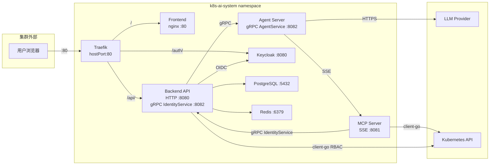
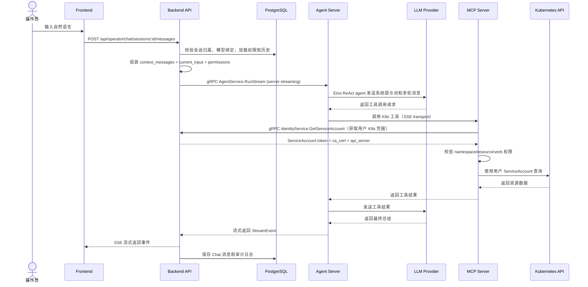
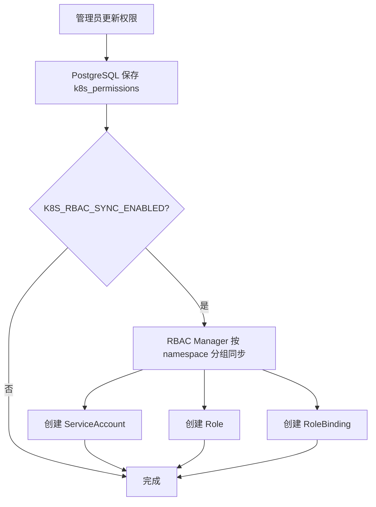

# 架构总览

这篇文档面向准备理解 k8s-agent 系统设计的开发者，解释当前四个服务的模块边界、分层架构和核心执行链路。

## 1. 部署架构

所有组件部署在 `k8s-ai-system` namespace：



## 2. 服务职责

| 服务 | 负责 | 不负责 |
|------|------|--------|
| **Traefik** | 路径路由、流量入口、hostPort 暴露 | 不参与认证授权 |
| **Frontend** | 页面展示、登录跳转、调用 Backend API | 不保存权限、不直接调 K8s |
| **Backend API** | 认证授权、用户管理、LLM 管理、Chat 编排、审计；同时运行 gRPC IdentityService server（为 MCP Server 提供用户 K8s 凭据和权限校验） | 不直接调 LLM 或 MCP Server |
| **Agent Server** | Eino 无状态 ReAct agent loop，gRPC server-streaming | 不保存 Chat 历史、不决定权限 |
| **MCP Server** | K8s 能力封装为 MCP 工具；每次工具调用前通过 Backend IdentityService 获取用户 K8s 凭据并校验权限；per-user K8s client 隔离 | 不决定业务权限、不管理用户 |
| **Keycloak** | 身份认证和平台角色 | 不保存 K8s 资源权限 |
| **PostgreSQL** | 持久化业务状态 | 不保存明文 token 和 API Key |
| **Redis** | 短期缓存和流式状态 | 不作为最终数据源 |

## 3. Backend 分层架构（DDD）

```text
backend/
├── cmd/api/main.go                 # 入口：依赖注入、路由注册
├── internal/
│   ├── domain/                     # 领域层：实体、仓储接口
│   ├── app/                        # 应用层：应用服务、DTO、用例编排
│   ├── infra/                      # 基础设施层
│   │   ├── agent/client.go         # gRPC AgentService 客户端
│   │   ├── auth/                   # Keycloak 集成
│   │   ├── cache/                  # Redis 客户端
│   │   ├── config/                 # 配置加载
│   │   ├── crypto/                 # AES-256-GCM 加密
│   │   ├── k8s/                    # K8s RBAC Manager (client-go)
│   │   └── postgres/               # PostgreSQL 仓储 (GORM)
│   └── interfaces/                 # 接口层
│       ├── http/                   # HTTP handler、路由、中间件、SSE
│       └── grpc/                   # gRPC IdentityService server
```

分层依赖规则：**接口层 → 应用层 → 领域层 ← 基础设施层**

## 4. Agent Server 内部结构

```text
agent-server/
├── cmd/server/main.go              # 入口：初始化 Eino + MCP 客户端 + gRPC server
├── internal/
│   ├── eino/
│   │   ├── config.go               # Eino ChatModel 和 MCP 工具配置
│   │   ├── runner.go               # ReAct agent runner，实现 RunStream
│   │   ├── llm/factory.go          # LLM ChatModel 工厂
│   │   └── mcp/client.go           # MCP SSE client，发现并注册工具
│   └── server/
│       └── server.go               # gRPC 服务实现
```

Agent Server 设计原则：无状态、只消费 Backend 传入的上下文、MCP 工具自动发现、Skills 渐进式披露。

## 5. MCP Server 内部结构

```text
mcp-server/
├── cmd/server/main.go              # 入口
├── internal/
│   ├── handler/                    # 8 个 MCP 工具处理器
│   ├── k8s/                        # Per-user K8s client 工厂
│   └── identity/                   # gRPC IdentityService 客户端（连接 Backend API）
```

MCP Server 设计原则：
- **每次工具调用独立构建 K8s client**：通过 Backend IdentityService gRPC 获取操作用户的 ServiceAccount token/ca/apiserver
- **工具执行前与 Backend 协同校验权限**：解析工具参数 → 调用 Backend 校验 namespace/resource/verb → 拒绝或放行
- **K8s RBAC 最终兜底**：即使上层校验有缺陷，K8s API Server 也会拒绝越权访问

## 6. 核心执行链路

### 6.1 Chat 消息完整链路



### 6.2 权限同步链路



## 7. 架构约束

- 操作员只允许 namespace 级权限，不允许集群级权限
- LLM 不直接访问 Kubernetes API
- MCP Server 只接受 Agent Server 调用
- MCP Server 每次工具调用前通过 Backend IdentityService 获取用户凭据并校验权限
- Kubernetes RBAC 是最终权限边界
- Agent Server 无状态，不持久化任何数据
- gRPC 契约（proto/）是服务间通信的唯一来源
- Traefik 只暴露 HTTP 入口，gRPC 和 SSE 走内部 ClusterIP

## 8. 为什么采用这种架构

### 8.1 不把所有逻辑放在 Backend

Agent loop 和 MCP 工具执行是独立运行时边界，拆成独立服务后可以独立扩缩容、独立升级 LLM 框架，Agent Server 故障不影响 Backend 的用户管理和审计。

### 8.2 MCP Server 通过 Backend 获取凭据

MCP Server 不直接访问 PostgreSQL 或 Keycloak，所有身份和权限数据统一通过 Backend 的 gRPC IdentityService 获取。这样权限逻辑集中在 Backend，MCP Server 只需要关注工具执行。

### 8.3 不用 LLM 直接调 K8s

MCP 协议将 LLM 的工具调用标准化，MCP Server 作为工具边界：权限校验可以集中管理，新增 K8s 资源类型只需在 MCP Server 增加工具，LLM Provider 切换不影响工具能力。

### 8.4 不把权限放在 JWT claims 中

K8s namespace 级权限存储在 PostgreSQL 中：权限变更不需要重新签发 JWT，JWT claims 不会因权限过多而膨胀，权限查询和审计独立于认证。
