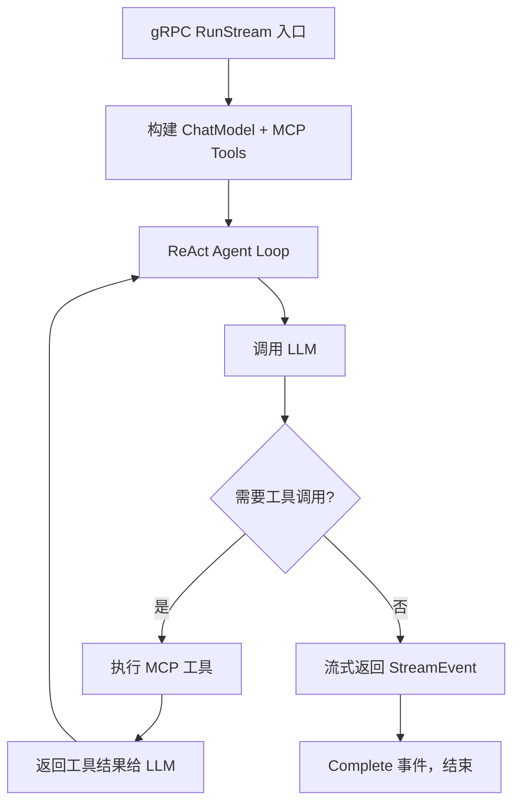
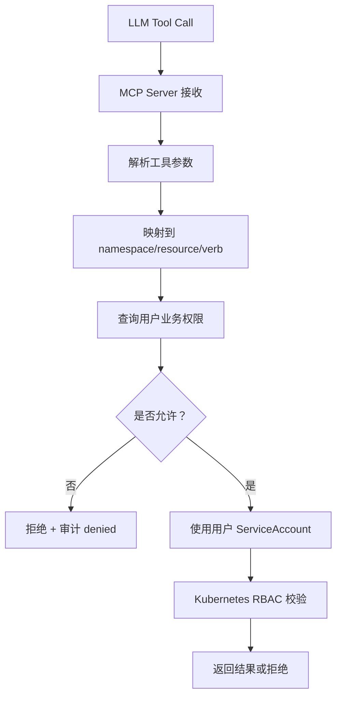

# 技术原理

这篇文档面向需要深入理解 k8s-agent 核心机制的开发者，解释几个关键技术原则及其在代码中的落地方式。

## 1. 无状态 Agent

### 1.1 原则

Agent Server 不连接数据库，不持久化任何 Chat 会话历史。每次 gRPC `RunStream` 请求独立建立 ReAct agent loop，请求结束后 agent 即销毁。

### 1.2 落地方式

- `agent-server/internal/eino/runner.go`：每次 `RunStream` 调用创建一个新的 Eino ChatModelAgent
- 多轮上下文由 Backend 通过 `AgentRunRequest.context_messages` 传入
- 权限快照由 Backend 通过 `AgentRunRequest.permissions` 传入
- Agent Server 不直接查询 PostgreSQL，不访问用户表、权限表

### 1.3 为什么这样设计

- Agent loop 是 CPU/LLM 密集型操作，独立的生命周期便于扩缩
- 无状态意味着 Agent Server 可以随时重启而不丢失数据
- Backend 作为"状态管家"，可以在多轮对话中做上下文裁剪和权限重新评估

## 2. ReAct Agent Loop

### 2.1 原则

Agent Server 使用 Eino ADK（Agent Development Kit）的 ChatModelAgent 实现标准 ReAct（Reasoning + Acting）模式：

1. LLM 接收系统提示词、用户输入和权限上下文
2. LLM 判断是否需要工具调用
3. 如需工具，执行工具调用并返回结果给 LLM
4. LLM 综合工具结果给出最终回答

### 2.2 落地方式



- `agent-server/internal/eino/runner.go`：创建 ChatModelAgent，注入 MCP tools adapter
- `agent-server/internal/eino/config.go`：组装 system prompt + tools + chat model
- Eino 框架负责 ReAct loop 的控制流（何时退出、何时重试）

### 2.3 流式事件（StreamEvent）

Agent Server 通过 gRPC server-streaming 向 Backend 发送事件，Backend 通过 SSE 中继到前端：

| 事件类型 | 说明 |
|----------|------|
| `Thinking` | Agent 的思考过程（自然语言推理） |
| `ToolCall` | LLM 决定调用工具（工具名 + 参数 JSON） |
| `ToolResult` | 工具执行完成（结构化返回数据） |
| `Resource` | 引用的 K8s 资源（namespace/name/kind） |
| `Complete` | Agent loop 完成（最终总结） |
| `Error` | 发生错误（错误码 + 消息） |

## 3. MCP 工具发现与注册

### 3.1 原则

Agent Server 不在代码中硬编码工具列表，而是通过 MCP 协议从 MCP Server 动态发现工具。每次请求只暴露当前操作员权限范围内的工具。

### 3.2 落地方式

1. Agent Server 启动时（或每次 RunStream 时）通过 MCP SSE client 连接 MCP Server
2. 调用 MCP `tools/list` 方法获取所有可用工具
3. 将工具注册到 Eino 的 tool adapter
4. Agent Server 在 `event=mcp_tool_discovery_complete` 日志中确认工具列表

关键代码：
- `agent-server/internal/eino/mcp/client.go`：MCP SSE client 实现
- 通过 `MCP_SERVER_URL` 环境变量配置连接地址

### 3.3 当前已注册的 MCP 工具

| 工具 | K8s 资源 | 用途 |
|------|----------|------|
| `list_namespaces` | 用户权限摘要 | 返回当前用户可见 namespace |
| `list_pods` | pods | 查询 Pod 列表和异常状态 |
| `get_pod` | pods | 查询 Pod 详情 |
| `get_pod_logs` | pods/log | 查询 Pod 日志 |
| `list_events` | events | 查询 Kubernetes 事件 |
| `get_pod_events` | events | 查询特定 Pod 的事件 |
| `list_deployments` | deployments.apps | 查询 Deployment |
| `restart_deployment` | deployments.apps | 通过 patch annotation 触发滚动重启 |

## 4. Skills 系统（渐进式能力披露）

### 4.1 原则

Skills 是存放在 `SKILLS_DIR` 目录下的运维知识单元。每个 skill 是一个子目录，包含 `SKILL.md` 定义文件。Skills 通过渐进式披露机制按需加载到 Agent 上下文，避免一次性把所有能力塞进 prompt。

### 4.2 落地方式

1. Agent Server 启动时，加载 skill 元数据索引（名称、描述）
2. ReAct loop 中，当 LLM 判断需要使用某 skill 时，动态加载对应 `SKILL.md` 内容
3. Skill 定义中包含的 MCP 工具映射触发实际 K8s 操作

关键事件日志：
- `event=skills_init`：Skills 加载成功
- `event=skills_init_error`：Skills 目录加载失败
- `event=skill_loaded`：单个 skill 加载成功
- `event=skill_load_error`：单个 skill 加载失败

## 5. 三层权限纵深防线

### 5.1 原则

系统权限采用纵深防御策略，即使某一层失效，后续层仍能拦截越权：

1. **prompt 层**：LLM prompt 中包含权限摘要，限制 LLM 生成的工具调用范围
2. **MCP Server 工具执行前校验**：解析工具参数 → 映射到 namespace/resource/verb → 查询业务权限
3. **Kubernetes RBAC 最终兜底**：MCP Server 使用 per-user ServiceAccount，K8s API Server 做最终授权

### 5.2 落地方式



- 业务权限校验在 MCP Server 的 handler 层
- ServiceAccount 通过 `mcp-server/internal/identity/client.go` 调用 Backend IdentityService gRPC 获取
- Per-user K8s client 在 `mcp-server/internal/k8s/` 中构建

## 6. gRPC 双通道通信

### 6.1 原则

系统内部使用两条 gRPC 通道，方向不同：

- **AgentService**（Backend → Agent Server）：server-streaming，Backend 发起 Chat 请求，Agent Server 流式返回事件
- **IdentityService**（MCP Server → Backend）：unary，MCP Server 查询用户 ServiceAccount 凭据

### 6.2 落地方式

Proto 定义：

```text
proto/agent/v1/agent.proto       # AgentService.RunStream (server-streaming)
proto/identity/v1/identity.proto  # IdentityService.GetServiceAccount (unary)
```

Backend 同时担任 AgentService client 和 IdentityService server。

## 7. 名称级幂等与托管标签

### 7.1 原则

Backend RBAC Manager 创建的 K8s 对象使用固定的命名规则和托管标签，确保：
- 重复执行不创建重复对象
- 可以识别哪些对象属于 k8s-agent 管理
- 清理时不会误删用户手动创建的对象

### 7.2 落地方式

对象命名规则：
- ServiceAccount: `k8s-ai-operator-{userId}`
- Role: `k8s-ai-role-{userId}-{namespace}`
- RoleBinding: `k8s-ai-binding-{userId}-{namespace}`

托管标签：
```text
app.kubernetes.io/name=k8s-ai-ops
app.kubernetes.io/managed-by=k8s-ai-ops-backend
```

## 8. 日志分层策略

### 8.1 原则

- 程序日志使用英文结构化格式（logrus JSON），便于 K8s/CI/CD/日志平台检索
- 审计日志写入 PostgreSQL `audit_logs` 表，包含脱敏后的请求和响应
- 日志中不输出 LLM API Key、ServiceAccount token、K8s Secret 明文、用户密码

### 8.2 落地方式

日志格式示例：

```text
level=INFO component=backend-api event=server_start addr=:8080
level=ERROR component=mcp-server event=server_exit error="listen tcp :8081: bind: address already in use"
```

## 9. 当前技术边界与后续方向

| 机制 | 当前限制 | 后续方向 |
|------|----------|----------|
| 无状态 Agent | 每次请求重建 agent loop，不缓存 LLM 连接 | 连接池复用 |
| Skills 系统 | 加载机制已有，按需触发待完善 | 更精细的 skill 触发判断 |
| MCP 工具发现 | 启动时全量发现，不支持热加载 | 动态工具注册 |
| 权限校验 | MCP Server 层做 namespace/resource/verb 匹配 | 按 resource name 细化 |
| RBAC 同步 | 单次同步，无重试机制 | 异步队列 + 重试 |
| gRPC | 无 mTLS | 生产环境 mTLS |
