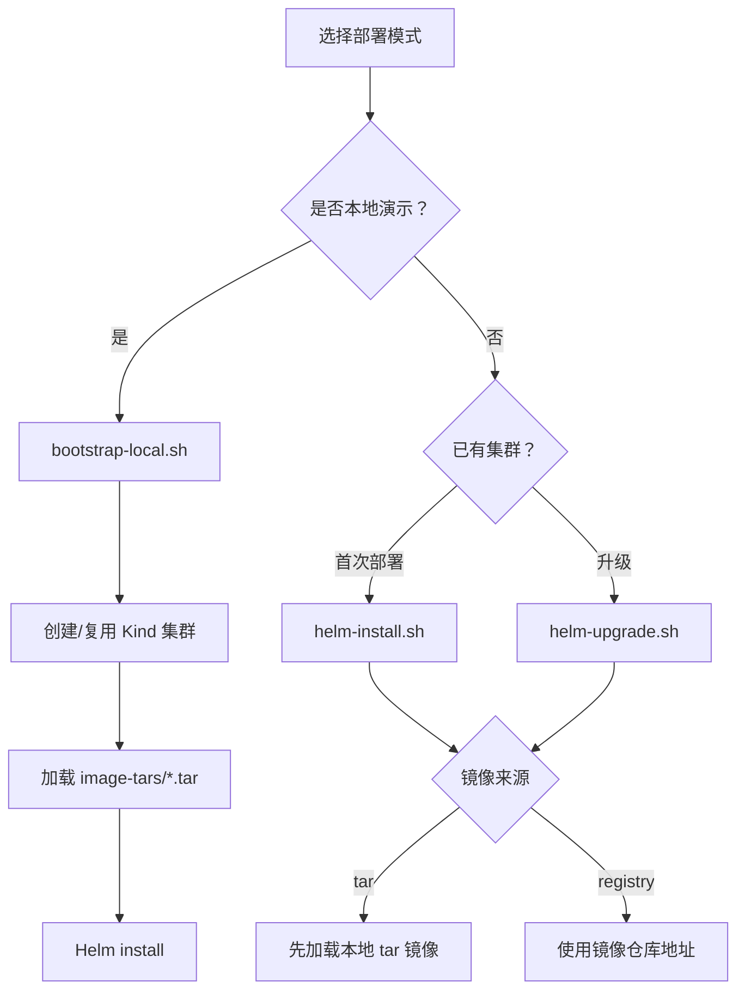

# 部署指南

## 部署模式



## 公有云 Kubernetes 部署说明

后续在公有云 Kubernetes 集群中测试时，本项目需要协助部署以下服务：

- PostgreSQL
- Redis
- Keycloak
- Backend API
- Agent Server
- MCP Server
- Frontend

公有云环境推荐使用 registry 镜像模式，避免每个节点手工导入 tar 镜像。完整测试步骤见 [公有云 Kubernetes 测试计划](public-cloud-test-plan.md)。

如果测试环境要求全部离线交付，可以继续使用本地 tar 镜像包，但需要结合云厂商节点镜像导入机制或先推送到私有镜像仓库。

## 本地完整启动

```bash
scripts/bootstrap-local.sh \
  --image-source tar \
  --image-dir image-tars \
  --cluster-name k8s-ai
```

脚本职责：

- 检查 `docker`、`kind`、`kubectl`、`helm`。
- 创建 Kind 集群。
- 创建 `dev`、`test` 演示 namespace。
- 加载本地 tar 镜像包。
- 调用 Helm 安装系统。
- 输出访问方式。

## 构建镜像和 tar 包

```bash
scripts/build-images.sh --tag local --output-dir image-tars
```

输出：

```text
image-tars/backend-api-amd64.tar
image-tars/agent-server-amd64.tar
image-tars/mcp-server-amd64.tar
image-tars/frontend-amd64.tar
```

## Helm-only 安装

```bash
scripts/helm-install.sh \
  --image-source tar \
  --image-dir image-tars \
  --values deploy/helm/k8s-ai-ops/values-local.yaml
```

## Helm-only 升级

```bash
scripts/helm-upgrade.sh \
  --image-source registry \
  --registry registry.example.com/k8s-ai \
  --tag v1.0.0 \
  --values deploy/helm/k8s-ai-ops/values-prod-example.yaml
```

## 公有云推荐命令

```bash
scripts/helm-install.sh \
  --image-source registry \
  --registry <registry> \
  --tag <tag> \
  --values deploy/helm/k8s-ai-ops/values-prod-example.yaml
```

部署前需要确认：

- 镜像已推送到 `<registry>`。
- 集群已配置 `imagePullSecrets` 或节点具备拉取权限。
- 当前 kubeconfig 有创建 namespace、Deployment、Service、Secret、ConfigMap、ServiceAccount、Role、RoleBinding 的权限。
- 已在 values 中配置 `rbac.managedNamespaces`，列出 Backend 允许管理操作员 RBAC 的业务 namespace。
- 如启用 Ingress，集群已安装 Ingress Controller。

## Helm Chart 结构

```text
deploy/helm/k8s-ai-ops/
  Chart.yaml
  values.yaml
  values-local.yaml
  values-prod-example.yaml
  templates/
    namespace.yaml
    frontend.yaml
    backend.yaml
    mcp-server.yaml
    keycloak.yaml
    postgresql.yaml
    redis.yaml
    rbac.yaml
    secret.yaml
```

## values 关键字段

```yaml
images:
  source: tar
  registry: ""
  tag: local
  pullPolicy: IfNotPresent

backend:
  storeDriver: postgres
  cacheDriver: redis
  rbacSyncEnabled: true

agentServer:
  replicas: 1
  service:
    port: 8082

rbac:
  managedNamespaces:
    - dev
    - test
```

- `source=tar`：默认模式，适合离线交付和 Kind 本地演示。
- `source=registry`：适合已有集群和 CI/CD。
- `registry`：镜像仓库前缀。
- `tag`：镜像 tag。
- `backend.rbacSyncEnabled=true`：管理员更新权限后同步 Kubernetes ServiceAccount、Role、RoleBinding。
- `agentServer.service.port`：Agent Server gRPC 服务端口，Backend 通过 `AGENT_SERVER_ADDR=agent-server:8082` 调用。
- `rbac.managedNamespaces`：namespace 级安全边界，只在列出的 namespace 内给 Backend 授权，不创建集群级管理权限。

## 访问方式

本地演示可使用端口转发：

```bash
kubectl port-forward -n k8s-ai-system svc/frontend 8088:80
kubectl port-forward -n k8s-ai-system svc/keycloak 8089:8080
```

然后访问：

```text
Frontend: http://localhost:8088
Keycloak: http://localhost:8089
```

## 卸载

```bash
scripts/uninstall.sh
```

默认不删除 PVC。需要删除数据时显式执行：

```bash
scripts/uninstall.sh --delete-data
```
