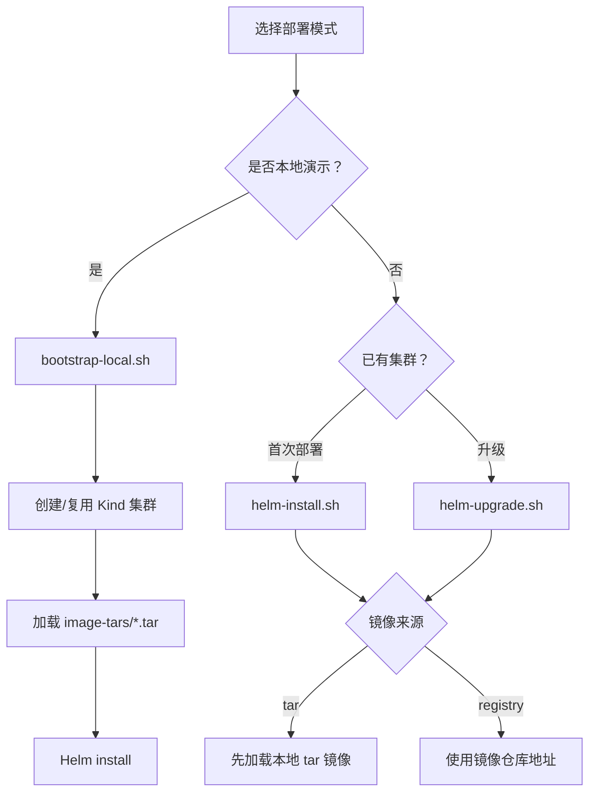

# 部署指南

这篇文档面向运维人员，说明如何构建镜像、部署到 Kubernetes 集群以及配置 Helm values。

## 1. 部署内容

一次完整的 Helm 安装会在 `k8s-ai-system` namespace 中部署以下组件：

| 组件 | 类型 | 副本 | 端口 | 说明 |
|------|------|------|------|------|
| Traefik | Deployment + ClusterIP | 1 | 8000, 8080 | API 网关，hostPort:80，CRD Provider |
| Frontend | Deployment + ClusterIP | 1 | 80 | nginx + React SPA |
| Backend API | Deployment + ClusterIP | 1 | 8080, 8082 | Go API + gRPC IdentityService |
| Agent Server | Deployment + ClusterIP | 1 | 8082 | Go Eino ReAct agent |
| MCP Server | Deployment + ClusterIP | 1 | 8081 | Go MCP 协议 SSE |
| Keycloak | Deployment + ClusterIP | 1 | 8080 | 认证服务 (可禁用) |
| PostgreSQL | Deployment + ClusterIP | 1 | 5432 | 业务数据库 (可禁用) |
| Redis | Deployment + ClusterIP | 1 | 6379 | 缓存 (可禁用) |

外加：`k8s-ai-system` Namespace、`k8s-ai-secrets` Secret、3 个 Traefik IngressRoute、RBAC 资源（ServiceAccount、Role、RoleBinding、ClusterRoleBinding）、Keycloak Realm ConfigMap。

## 2. 部署模式



## 3. 构建镜像

```bash
scripts/build-images.sh --tag local --output-dir image-tars
```

输出 4 个 tar 包：

```text
image-tars/backend-api-amd64.tar
image-tars/agent-server-amd64.tar
image-tars/mcp-server-amd64.tar
image-tars/frontend-amd64.tar
```

Go 服务构建时自动注入 `-ldflags="-s -w"` 去除调试符号。

## 4. 本地 Kind 启动（从零开始）

```bash
scripts/bootstrap-local.sh \
  --image-source tar \
  --image-dir image-tars \
  --cluster-name k8s-ai
```

脚本职责：

- 检查 `docker`、`kind`、`kubectl`、`helm`
- 创建 Kind 集群
- 创建 `dev`、`test` 演示 namespace（按 `rbac.managedNamespaces` 配置）
- 加载本地 tar 镜像到 Kind 节点
- 调用 `helm-install.sh` 安装系统

## 5. Helm-only 操作

### 首次安装

```bash
scripts/helm-install.sh \
  --image-source tar \
  --image-dir image-tars \
  --values deploy/helm/k8s-ai-ops/values-local.yaml
```

本地 tar 部署使用 `values-local.yaml`，当前约定前端镜像仓库名为 `k8s-ai-mcp-frontend`。如使用默认 `k8s-ai-frontend` 镜像名，通过 `--set frontend.image.repository=k8s-ai-frontend` 覆盖。

### 升级

```bash
scripts/helm-upgrade.sh \
  --image-source registry \
  --registry registry.example.com/k8s-ai \
  --tag v1.0.0 \
  --values deploy/helm/k8s-ai-ops/values-prod-example.yaml
```

## 6. 公有云部署

```bash
scripts/helm-install.sh \
  --image-source registry \
  --registry <registry> \
  --tag <tag> \
  --values deploy/helm/k8s-ai-ops/values-prod-example.yaml
```

部署前确认：

- 镜像已推送到 `<registry>`
- 集群已配置 `imagePullSecrets` 或节点具备拉取权限
- 当前 kubeconfig 有创建 Namespace、Deployment、Service、Secret、ConfigMap、ServiceAccount、Role、RoleBinding、ClusterRoleBinding 的权限
- 已在 values 中配置 `rbac.managedNamespaces`
- Traefik CRD 已安装：`ingressroutes.traefik.io`、`middlewares.traefik.io`、`traefikservices.traefik.io`
- `traefik.hostPort` 不与宿主机其他服务端口冲突

## 7. Helm values 完整参考

见 [配置参考](../reference/config-reference.md) 的 Helm values 章节。

### 关键配置项

| 配置 | 默认值 | 说明 |
|------|--------|------|
| `images.source` | `tar` | `tar`（Kind/离线）或 `registry`（已有集群） |
| `images.tag` | `local` | 所有服务镜像的统一 tag |
| `backend.storeDriver` | `postgres` | `postgres` 或 `memory` |
| `backend.cacheDriver` | `redis` | `redis` 或 `memory` |
| `backend.rbacSyncEnabled` | `true` | 是否在权限更新时同步 K8s RBAC |
| `backend.authMode` | `jwt` | `dev`（信任 X-Demo-User 头）、`jwt`（验证 Keycloak JWT）、`none` |
| `backend.keycloakIssuer` | 公网 Keycloak 地址 | Keycloak OIDC Issuer URL，必须与浏览器登录后 Token 中的 `iss` 完全一致，例如 `http://120.55.84.39/auth/realms/k8s-ai` |
| `rbac.managedNamespaces` | `[]` | Backend 可管理操作员 RBAC 的 namespace 列表 |
| `rbac.adminServiceAccount.enabled` | `true` | 是否创建 cluster-admin 绑定管理员 SA |
| `traefik.enabled` | `true` | 是否部署内置 Traefik |
| `traefik.hostPort` | `80` | Traefik web entrypoint 映射的宿主机端口 |
| `keycloak.enabled` | `true` | 是否部署内置 Keycloak（可关闭以使用外部 Keycloak） |
| `postgresql.enabled` | `true` | 是否部署内置 PostgreSQL（可关闭以使用外部数据库） |
| `redis.enabled` | `true` | 是否部署内置 Redis（可关闭以使用外部 Redis） |

## 8. 访问系统

如果 Traefik hostPort 正常工作，直接访问 `http://<node-ip>:80`。

否则使用端口转发：

```bash
kubectl port-forward -n k8s-ai-system svc/frontend 8088:80
kubectl port-forward -n k8s-ai-system svc/keycloak 8089:8080
```

访问：

```text
Frontend:  http://localhost:8088（或 node-ip:80）
Keycloak:  http://localhost:8089（或 node-ip:80/auth/）
API:       http://node-ip:80/api/
```

预置管理员账号：`admin / admin`

## 9. 外部依赖接入

如果云上已有 PostgreSQL/Redis/Keycloak，关闭内置组件并配置外部地址：

```yaml
postgresql:
  enabled: false

redis:
  enabled: false

keycloak:
  enabled: false
```

然后通过 Backend 环境变量或 additional env 指定外部服务连接地址。这种方式下还需要额外处理 Keycloak Realm 和 Client 的手动创建。

## 10. 卸载

```bash
scripts/uninstall.sh
```

默认不删除 PVC。删除数据：

```bash
scripts/uninstall.sh --delete-data
```

## 11. 部署后验证

```bash
# Pod 状态（预期全部 Running）
kubectl get pods -n k8s-ai-system

# 关键日志
kubectl logs -n k8s-ai-system deploy/backend-api
kubectl logs -n k8s-ai-system deploy/agent-server
kubectl logs -n k8s-ai-system deploy/mcp-server

# Traefik 路由
kubectl get ingressroutes -n k8s-ai-system

# RBAC
kubectl get sa,role,rolebinding -n k8s-ai-system
kubectl get sa,role,rolebinding -n dev   # 按 rbac.managedNamespaces

# 验证 Backend RBAC 权限
kubectl auth can-i create serviceaccounts -n dev \
  --as=system:serviceaccount:k8s-ai-system:k8s-ai-backend

# 验证操作员 SA 不存在时被拒绝
kubectl auth can-i list pods -n dev \
  --as=system:serviceaccount:dev:k8s-ai-operator-nonexistent
```
