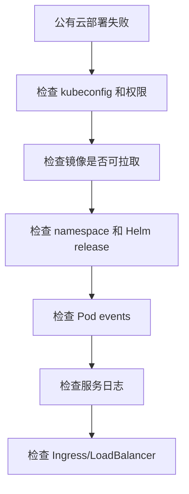
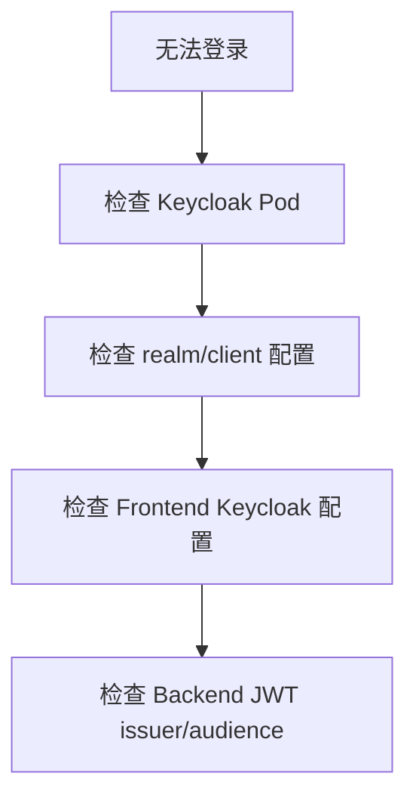
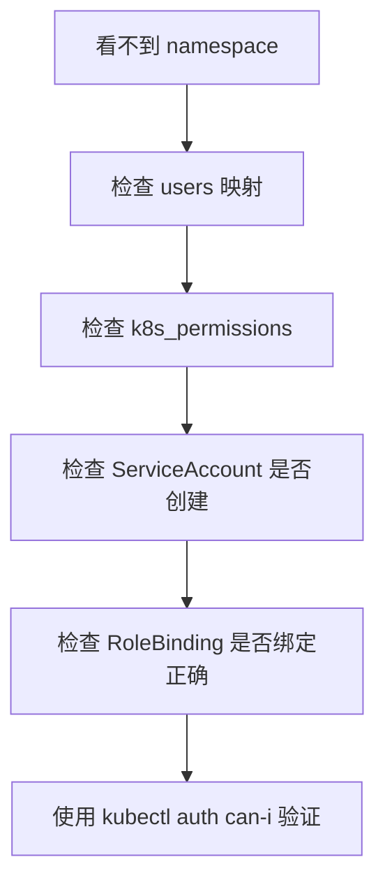
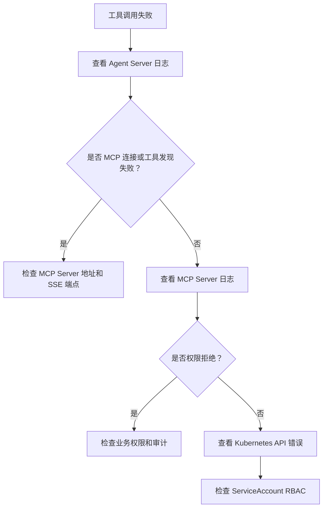

# 日志、审计与排错

## Agent Server 日志和排错

新增组件日志名：

- `component=backend-api event=agent_server_connected`：Backend 已连接 Agent Server。
- `component=backend-api event=agent_server_connect_failed`：Backend 启动时无法连接 Agent Server。
- `component=agent-server event=server_start protocol=grpc`：Agent Server gRPC 服务启动。
- `component=agent-server event=run_stream_start`：Agent Server 收到一次流式 Run 请求。
- `component=agent-server event=agent_tools_ready`：Agent Server 已为当前用户注入 MCP 工具。
- `component=agent-server event=tool_call_emit`：Agent Server 向 Backend 推送工具调用事件。
- `component=agent-server event=mcp_tool_discovery_complete`：Agent Server 已从 MCP Server 发现内置工具。
- `component=mcp-server event=server_start`：MCP 工具服务启动。
- `component=agent-server event=skills_init`：Agent Server 加载 Skills 配置（从 `SKILLS_DIR` 目录）。
- `component=agent-server event=skills_init_error`：Skills 目录加载失败。
- `component=agent-server event=skill_loaded`：单个 skill 文件加载成功。
- `component=agent-server event=skill_load_error`：单个 skill 文件加载失败。

排查 Chat 失败时按 `Frontend -> backend-api -> agent-server -> mcp-server -> Kubernetes API` 顺序检查。

## 程序日志

程序日志使用英文结构化格式，便于在 Kubernetes、CI/CD 和日志平台检索。

推荐格式：

```text
level=INFO component=backend-api event=server_start addr=:8080
level=ERROR component=mcp-server event=server_exit error="listen tcp :8081: bind: address already in use"
```

字段建议：

| 字段 | 说明 |
| --- | --- |
| `level` | `DEBUG`、`INFO`、`WARN`、`ERROR` |
| `component` | 服务或模块名 |
| `event` | 事件名 |
| `request_id` | 请求 ID |
| `user_id` | 用户 ID，不能使用敏感 token |
| `namespace` | Kubernetes namespace |
| `resource` | Kubernetes resource |
| `verb` | Kubernetes verb |
| `error` | 错误内容 |

## 审计事件

必须审计：

- 用户创建、禁用、恢复。
- 权限分配和变更。
- ServiceAccount、Role、RoleBinding 创建或更新。
- LLM Provider 和 Model 配置变更。
- Chat 消息。
- LLM 工具调用。
- Kubernetes API 操作。
- 授权拒绝。

## 排错路径

### 公有云部署失败



常用命令：

```bash
kubectl get pods -n k8s-ai-system
kubectl describe pod -n k8s-ai-system <pod-name>
kubectl get events -n k8s-ai-system --sort-by=.lastTimestamp
kubectl logs -n k8s-ai-system deploy/backend-api
kubectl logs -n k8s-ai-system deploy/mcp-server
```

### 本地 PostgreSQL/Redis 集成测试失败

排查顺序：

1. 确认 WSL Docker 正常：

```bash
wsl docker ps
```

2. 启动本项目专用依赖：

```bash
wsl bash /mnt/e/k8s-agent/scripts/dev-infra-wsl.sh
```

3. 确认容器运行：

```bash
wsl docker ps --filter name=k8s-ai
```

4. 确认端口没有被其他容器占用：

```bash
wsl docker ps
```

本项目默认使用：

```text
PostgreSQL: localhost:55432
Redis: localhost:56379
```

### 用户无法登录



### 操作员看不到 namespace



### Chat 工具调用失败



### SSE 连接与流式中断

Agent Server 通过 MCP SSE client 连接 MCP Server，Backend 通过 gRPC `RunStream` 接收事件后 SSE 中继到前端。如果出现流式中断或工具无响应，按以下路径排查：

1. **检查 MCP Server 健康状态**：
   ```bash
   curl -v http://localhost:8081/sse
   ```
   预期返回 SSE content-type 和持久连接。如果连接被拒绝，检查 MCP Server 是否启动且端口正确。

2. **检查 Agent Server 与 MCP Server 的 SSE 连接**：
   - 查看 Agent Server 日志中 `event=mcp_tool_discovery_complete` 事件，确认工具列表已成功发现。
   - 如果该事件未出现，检查 Agent Server 的 `MCP_SERVER_URL` 环境变量（默认 `http://localhost:8081/sse`）。

3. **检查 Backend SSE 中继**：
   - Backend 调用 Agent Server 的 `RunStream` gRPC 接口后，将 `StreamEvent` 转换为 SSE 事件发送给前端。
   - 如果前端收到的 SSE 事件不完整或中途断开，查看 Backend 日志中 `event=agent_stream_event` 和 `event=sse_write_error` 事件。

4. **检查工具调用超时**：
   - MCP 工具调用涉及 Kubernetes API 查询，部分操作（如 `get_pod_logs`）可能耗时较长。
   - 如果工具调用超时，检查 MCP Server 与 Kubernetes API 之间的网络延迟，以及 Pod 日志大小是否超出 buffer 限制。

5. **排查 SSE 客户端重连**：
   - MCP SSE 客户端支持自动重连，Agent Server 日志中会出现 `event=mcp_sse_reconnect` 事件。
   - 如果频繁重连，检查 MCP Server 负载和网络稳定性。

### LLM 不可用

排查顺序：

1. 检查 Provider 是否启用。
2. 检查模型是否启用并绑定给用户。
3. 检查 `base_url` 是否可达。
4. 检查 API Key 是否配置。
5. 检查 Provider 协议是否匹配。
6. 查看 Backend LLM adapter 错误日志。

## 敏感信息处理

日志和审计中禁止出现：

- LLM API Key。
- ServiceAccount token。
- Kubernetes Secret 明文。
- 用户密码。
- 原始 Authorization header。
