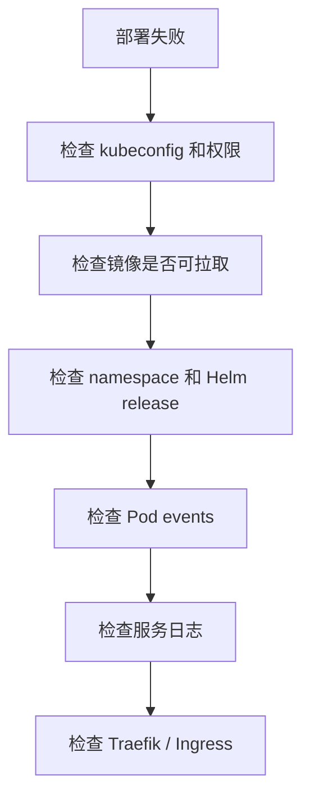
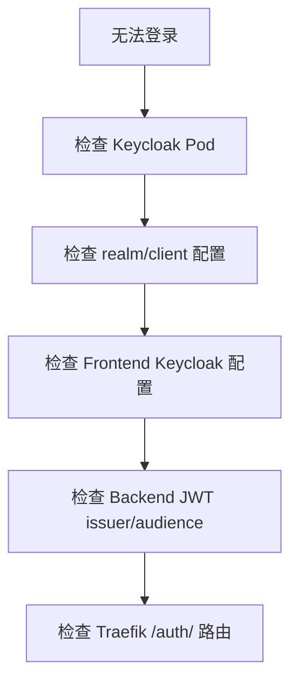
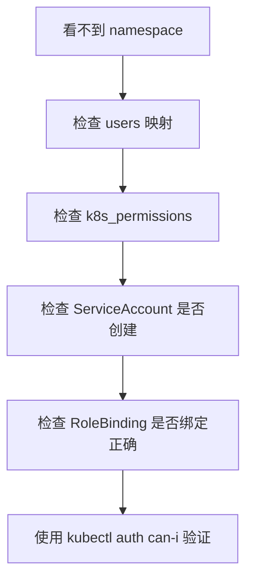
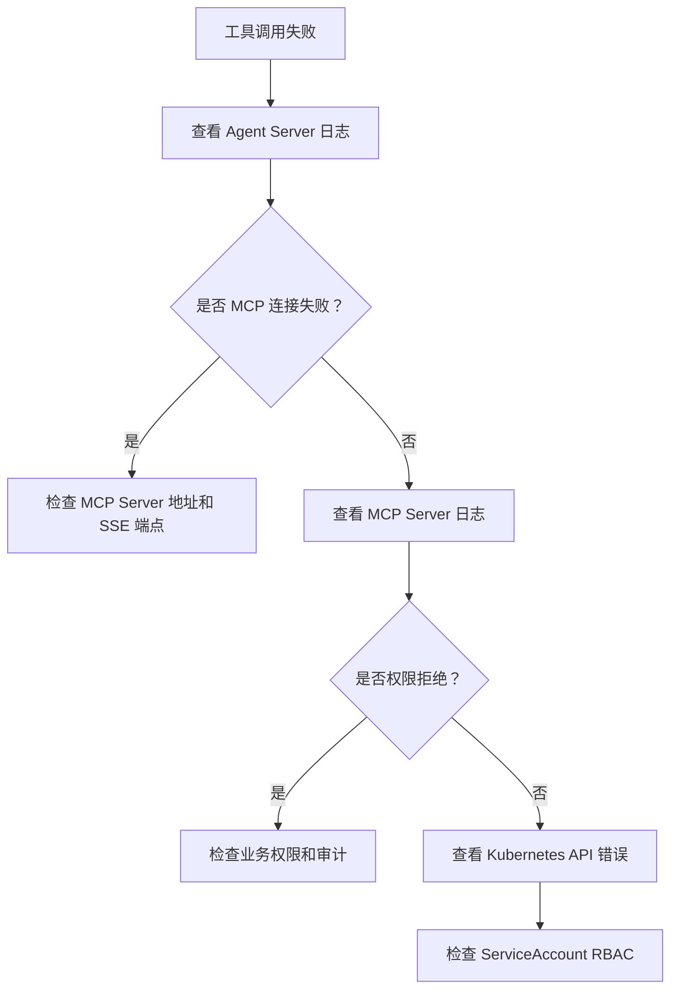

# 日志、审计与排错

这篇文档面向运维人员，说明日志规范、审计事件和常见问题的排查路径。

## 1. 程序日志

程序日志使用英文结构化格式（logrus JSON），便于在 Kubernetes、CI/CD 和日志平台检索。

推荐格式：

```text
level=INFO component=backend-api event=server_start addr=:8080
level=ERROR component=mcp-server event=server_exit error="listen tcp :8081: bind: address already in use"
```

字段说明：

| 字段 | 说明 |
|------|------|
| `level` | `DEBUG`、`INFO`、`WARN`、`ERROR` |
| `component` | 服务或模块名 |
| `event` | 事件名 |
| `request_id` | 请求 ID |
| `user_id` | 用户 ID，禁止使用敏感 token |
| `namespace` | Kubernetes namespace |
| `resource` | Kubernetes resource |
| `verb` | Kubernetes verb |
| `error` | 错误内容 |

## 2. 各组件关键日志事件

排查 Chat 失败时按 `Frontend → Traefik → backend-api → agent-server → mcp-server → Kubernetes API` 顺序检查。

### Agent Server

- `event=server_start protocol=grpc`：gRPC 服务启动
- `event=mcp_tool_discovery_complete`：已从 MCP Server 发现工具列表
- `event=run_stream_start`：收到一次 RunStream 请求
- `event=agent_tools_ready`：已为当前用户注入 MCP 工具
- `event=tool_call_emit`：向 Backend 推送工具调用事件
- `event=skills_init` / `event=skills_init_error`：Skills 加载状态
- `event=skill_loaded` / `event=skill_load_error`：单个 skill 加载状态

### Backend API

- `event=agent_server_connected`：已连接 Agent Server
- `event=agent_server_connect_failed`：启动时无法连接 Agent Server
- `event=agent_stream_event`：收到 Agent Server 流式事件
- `event=sse_write_error`：SSE 写入前端失败

### MCP Server

- `event=server_start`：MCP 工具服务启动
- `event=mcp_sse_reconnect`：MCP SSE 客户端重连（频繁重连需检查负载和网络）

## 3. 审计事件

审计日志写入 PostgreSQL `audit_logs` 表，包含脱敏后的请求和响应。

必须审计：

- 用户创建、禁用、恢复
- 权限分配和变更
- ServiceAccount、Role、RoleBinding 创建或更新
- LLM Provider 和 Model 配置变更
- Chat 消息
- LLM 工具调用
- Kubernetes API 操作
- 授权拒绝

## 4. 排错路径

### 部署失败（公有云或本地）



常用命令：

```bash
kubectl get pods -n k8s-ai-system
kubectl describe pod -n k8s-ai-system <pod-name>
kubectl get events -n k8s-ai-system --sort-by=.lastTimestamp
kubectl logs -n k8s-ai-system deploy/backend-api
kubectl logs -n k8s-ai-system deploy/agent-server
kubectl logs -n k8s-ai-system deploy/mcp-server
```

### 本地 PostgreSQL/Redis 集成测试失败

排查顺序：

1. 确认 WSL Docker 正常：`wsl docker ps`
2. 启动本项目专用依赖：`wsl bash /mnt/e/k8s-agent/scripts/dev-infra-wsl.sh`
3. 确认容器运行：`wsl docker ps --filter name=k8s-ai`
4. 确认端口未被占用：`wsl docker ps`

本项目默认端口：

```text
PostgreSQL: localhost:55432
Redis: localhost:56379
```

### 用户无法登录



### 操作员看不到 namespace



### Chat 工具调用失败



### SSE 连接与流式中断

1. **检查 MCP Server 健康状态**：
   ```bash
   curl -v http://localhost:8081/sse
   ```
   预期返回 SSE content-type 和持久连接。

2. **检查 Agent Server 与 MCP Server 的 SSE 连接**：
   - 查看 Agent Server 日志中 `event=mcp_tool_discovery_complete`
   - 如未出现，检查 `MCP_SERVER_URL` 环境变量

3. **检查 Backend SSE 中继**：
   - Backend 将 Agent Server `StreamEvent` 转换为 SSE 事件发送给前端
   - 如 SSE 不完整或中途断开，查看 `event=agent_stream_event` 和 `event=sse_write_error`

4. **检查工具调用超时**：
   - `get_pod_logs` 等操作可能耗时较长
   - 检查 MCP Server 与 K8s API 之间的网络延迟

5. **排查 SSE 客户端重连**：
   - 频繁出现 `event=mcp_sse_reconnect` 时需要检查 MCP Server 负载和网络稳定性

### LLM 不可用

排查顺序：

1. 检查 Provider 是否启用
2. 检查模型是否启用并绑定给用户
3. 检查 `base_url` 是否可达
4. 检查 API Key 是否配置
5. 检查 Provider 协议是否匹配
6. 查看 Agent Server LLM adapter 错误日志

## 5. 敏感信息处理

日志和审计中禁止出现：

- LLM API Key
- ServiceAccount token
- Kubernetes Secret 明文
- 用户密码
- 原始 Authorization header
