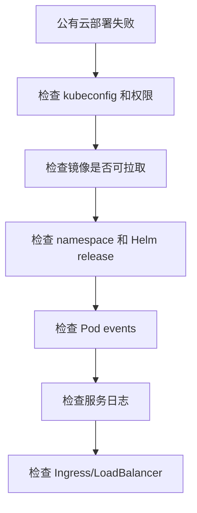
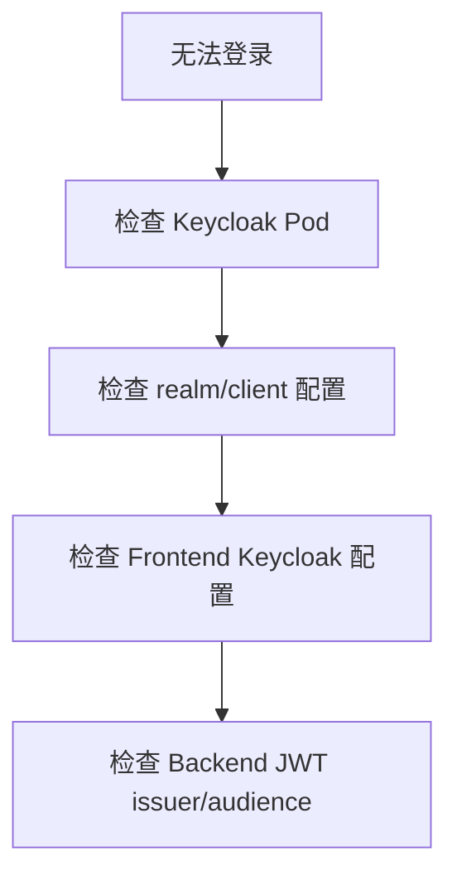
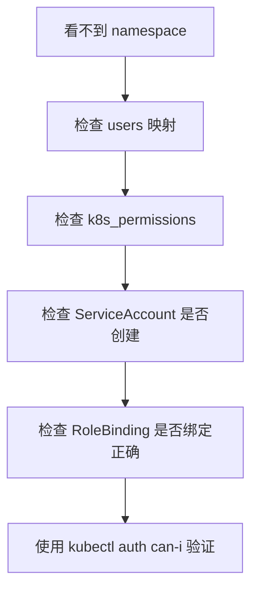
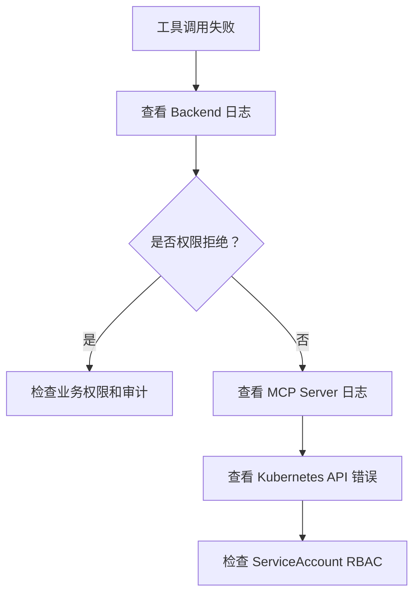

# 日志、审计与排错

## Agent Server 日志和排错

新增组件日志名：

- `component=backend-api event=agent_server_connected`：Backend 已连接 Agent Server。
- `component=backend-api event=agent_server_connect_failed`：Backend 启动时无法连接 Agent Server。
- `component=agent-server event=server_start protocol=grpc`：Agent Server gRPC 服务启动。
- `component=mcp-server event=server_start`：MCP 工具服务启动。

排查 Chat 失败时按 `Frontend -> backend-api -> agent-server -> mcp-server -> Kubernetes API` 顺序检查。

## 程序日志

程序日志使用英文结构化格式，便于在 Kubernetes、CI/CD 和日志平台检索。

推荐格式：

```text
level=INFO component=backend-api event=server_start addr=:8080
level=ERROR component=mcp-server event=server_exit error="listen tcp :8081: bind: address already in use"
```

字段建议：

| 字段 | 说明 |
| --- | --- |
| `level` | `DEBUG`、`INFO`、`WARN`、`ERROR` |
| `component` | 服务或模块名 |
| `event` | 事件名 |
| `request_id` | 请求 ID |
| `user_id` | 用户 ID，不能使用敏感 token |
| `namespace` | Kubernetes namespace |
| `resource` | Kubernetes resource |
| `verb` | Kubernetes verb |
| `error` | 错误内容 |

## 审计事件

必须审计：

- 用户创建、禁用、恢复。
- 权限分配和变更。
- ServiceAccount、Role、RoleBinding 创建或更新。
- LLM Provider 和 Model 配置变更。
- Chat 消息。
- LLM 工具调用。
- Kubernetes API 操作。
- 授权拒绝。

## 排错路径

### 公有云部署失败



常用命令：

```bash
kubectl get pods -n k8s-ai-system
kubectl describe pod -n k8s-ai-system <pod-name>
kubectl get events -n k8s-ai-system --sort-by=.lastTimestamp
kubectl logs -n k8s-ai-system deploy/backend-api
kubectl logs -n k8s-ai-system deploy/mcp-server
```

### 本地 PostgreSQL/Redis 集成测试失败

排查顺序：

1. 确认 WSL Docker 正常：

```bash
wsl docker ps
```

2. 启动本项目专用依赖：

```bash
wsl bash /mnt/e/k8s-agent/scripts/dev-infra-wsl.sh
```

3. 确认容器运行：

```bash
wsl docker ps --filter name=k8s-ai
```

4. 确认端口没有被其他容器占用：

```bash
wsl docker ps
```

本项目默认使用：

```text
PostgreSQL: localhost:55432
Redis: localhost:56379
```

### 用户无法登录



### 操作员看不到 namespace



### Chat 工具调用失败



### LLM 不可用

排查顺序：

1. 检查 Provider 是否启用。
2. 检查模型是否启用并绑定给用户。
3. 检查 `base_url` 是否可达。
4. 检查 API Key 是否配置。
5. 检查 Provider 协议是否匹配。
6. 查看 Backend LLM adapter 错误日志。

## 敏感信息处理

日志和审计中禁止出现：

- LLM API Key。
- ServiceAccount token。
- Kubernetes Secret 明文。
- 用户密码。
- 原始 Authorization header。
