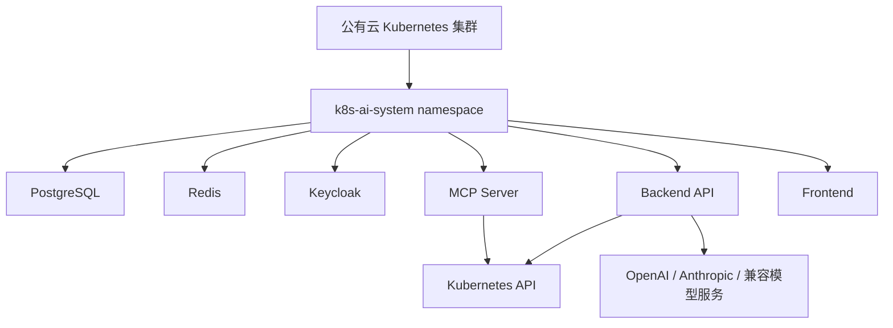

# 公有云 Kubernetes 测试计划

## 目标

后续在公有云 Kubernetes 集群准备完成后，需要在真实集群中部署并验证 K8S AI Ops 的依赖服务和自有服务，完成从安装到业务巡检的端到端测试。

该阶段目标不是只验证 Pod 能启动，而是验证以下闭环：

- PostgreSQL 可用并能持久化业务数据。
- Redis 可用并能支持缓存和后续流式状态。
- Keycloak 可用并能完成用户登录和角色管理。
- Backend API、Agent Server、MCP Server、Frontend 可部署、可访问、可观测。
- Backend 可在集群中创建操作员 ServiceAccount、Role、RoleBinding。
- 操作员 Chat 可以在授权 namespace 内巡检异常 Pod。
- 越权访问会被拒绝并写入审计日志。

## 部署范围



第一阶段由本项目 Helm Chart 部署以下服务：

- PostgreSQL
- Redis
- Keycloak
- Backend API
- Agent Server
- MCP Server
- Frontend

如果公有云环境已经提供托管 PostgreSQL、托管 Redis 或已有 Keycloak，可通过 Helm values 关闭内置依赖并接入外部服务。

## 前置条件

公有云 Kubernetes 集群需要提前准备：

- 可用的 `kubectl` 访问凭据。
- 目标 namespace 创建权限。
- 部署 Deployment、Service、Secret、ConfigMap 的权限。
- 创建 ServiceAccount、Role、RoleBinding 的权限。
- 如需 Ingress，对应 Ingress Controller 已安装。
- 如使用私有镜像仓库，镜像仓库地址和 `imagePullSecrets` 已准备。
- 如使用本地 tar 包，具备将镜像导入节点或推送到镜像仓库的方案。

## 推荐部署方式

公有云环境优先推荐使用镜像仓库模式：

```bash
scripts/helm-install.sh \
  --image-source registry \
  --registry registry.example.com/k8s-ai \
  --tag v1.0.0 \
  --values deploy/helm/k8s-ai-ops/values-prod-example.yaml
```

如果公有云测试环境无法访问镜像仓库，也可以使用本地 tar 包，但需要根据云厂商节点镜像导入方式调整流程。

## Helm values 配置项

公有云测试需要重点确认：

```yaml
images:
  source: registry
  registry: registry.example.com/k8s-ai
  tag: v1.0.0
  imagePullSecrets: []

keycloak:
  enabled: true

postgresql:
  enabled: true

redis:
  enabled: true

ingress:
  enabled: true
```

如使用外部依赖：

```yaml
keycloak:
  enabled: false

postgresql:
  enabled: false

redis:
  enabled: false
```

同时需要给 Backend 配置外部服务连接地址、用户名、密码和 Keycloak issuer。

## 测试步骤

### 1. 集群连通性

```bash
kubectl cluster-info
kubectl get nodes
kubectl auth can-i create rolebindings --all-namespaces
```

### 2. 部署依赖和服务

```bash
scripts/helm-install.sh \
  --image-source registry \
  --registry <registry> \
  --tag <tag> \
  --values deploy/helm/k8s-ai-ops/values-prod-example.yaml
```

### 3. 验证 Pod 状态

```bash
kubectl get pods -n k8s-ai-system
kubectl get svc -n k8s-ai-system
```

### 4. 验证依赖服务

```bash
kubectl logs -n k8s-ai-system deploy/postgresql
kubectl logs -n k8s-ai-system deploy/redis
kubectl logs -n k8s-ai-system deploy/keycloak
```

### 5. 验证自有服务

```bash
kubectl logs -n k8s-ai-system deploy/backend-api
kubectl logs -n k8s-ai-system deploy/mcp-server
kubectl logs -n k8s-ai-system deploy/frontend
```

### 6. 验证访问入口

如果未配置 Ingress，可先使用端口转发：

```bash
kubectl port-forward -n k8s-ai-system svc/frontend 8088:80
kubectl port-forward -n k8s-ai-system svc/keycloak 8089:8080
```

### 7. 验证管理员流程

1. 登录 Keycloak。
2. 创建管理员或确认初始化管理员存在。
3. 登录 Admin Console。
4. 创建操作员。
5. 给操作员分配 `dev` namespace 的 Pod 只读权限。
6. 绑定可用 LLM 模型。
7. 查看审计日志是否记录创建和授权动作。

### 8. 验证操作员流程

1. 使用操作员登录。
2. 查看可用权限和模型。
3. 输入：`帮我看看现在集群里有什么异常吗？`
4. 确认系统只巡检授权 namespace。
5. 确认 UI 返回 AI 总结和异常 Pod 表格。

### 9. 验证越权拦截

1. 操作员请求访问未授权 namespace。
2. Backend 应拒绝工具调用。
3. Kubernetes API 不应被越权调用。
4. 审计日志记录 denied 事件。

## 验收标准

Agent Server 相关验收：

- `agent-server` Pod 正常运行并暴露 gRPC `8082`。
- `backend-api` 环境变量 `AGENT_SERVER_ADDR=agent-server:8082`。
- NetworkPolicy 或安全组允许 `backend-api` 访问 `agent-server:8082`。
- Chat 巡检请求能在 Backend 审计中看到 `operator.tool.call` 事件。

- 所有 Pod 正常运行。
- Frontend、Backend、MCP Server 可访问。
- PostgreSQL、Redis、Keycloak 可用。
- 管理员可以创建操作员并分配权限。
- 系统可以动态创建 ServiceAccount、Role、RoleBinding。
- 操作员只能巡检授权 namespace。
- 越权访问被拒绝并写入审计。
- 程序日志为英文结构化格式，便于排查。

## 待公有云环境确认的信息

后续开始公有云测试前，需要确认：

- Kubernetes 集群类型和版本。
- `kubectl` 访问方式。
- 是否使用 Ingress。
- 是否使用云厂商 LoadBalancer。
- 镜像仓库地址和认证方式。
- 是否使用内置 PostgreSQL/Redis/Keycloak。
- LLM Provider 类型、地址、模型名和 API Key 配置方式。
- 需要测试的业务 namespace。
