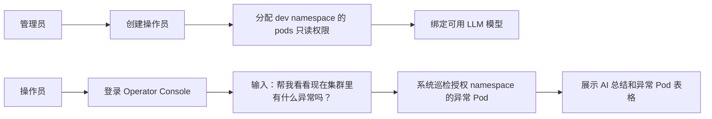

# 产品概览

## 项目定位

K8S AI Ops 是一个面向 Kubernetes 运维场景的 AI 助手平台。系统通过 MCP 将 Kubernetes API 封装成可控工具，让操作员可以通过自然语言完成集群巡检和授权范围内的资源操作。

项目既要满足面试题中“基于 MCP 的 K8S AI 运维助手”要求，也要体现接近企业级平台的设计能力：多角色、权限隔离、LLM 管理、审计、安全边界、Helm 部署和离线镜像交付。

## 核心价值

- 用自然语言降低 Kubernetes 巡检和常见运维操作门槛。
- 用 Keycloak 和 Kubernetes RBAC 建立清晰的身份与权限边界。
- 用 Backend 统一管控 LLM 工具调用，避免 LLM 直接接触集群凭据。
- 用 Agent Server 承接 Eino agent loop，让 LLM 编排和业务 API 解耦。
- 用 MCP Server 将 Kubernetes 能力抽象成可审计、可扩展的工具。
- 用 Helm 和 tar 镜像包支持本地演示、离线交付和已有集群部署。

## 产品边界

第一阶段重点建设：

- 管理员创建用户、配置权限、配置 LLM。
- 操作员通过 Chat 巡检异常 Pod。
- Backend 管理 Chat 历史、多轮上下文、权限快照和审计。
- Agent Server 使用 Eino 消费 `context_messages`、`current_input` 和 `permissions`，执行单轮推理和工具编排。
- Backend 与 Agent Server 使用 proto 生成的 gRPC 契约通信。
- Backend 执行模型授权和上下文筛选，MCP Server 执行工具权限校验。
- MCP Server 使用操作员 ServiceAccount 访问 Kubernetes。
- 所有关键操作写审计日志。

第一阶段暂不建设：

- LLM 用量计费和配额。
- 集群级操作员权限。
- 多集群管理。
- 复杂审批流。
- 完整生产级 HA 和备份恢复。

## MVP 演示闭环

## 成功标准

- 面试官能在 5 分钟内理解系统解决什么问题。
- 技术评审能通过架构图看懂 UI、Backend、MCP、LLM、K8S API 的调用链。
- 安全评审能看懂为什么操作员不会越权访问 Kubernetes。
- 二开开发者能根据文档找到代码入口和扩展点。
- 运维人员能根据部署文档选择本地 tar 或 registry 模式部署。

## 当前实现状态

第一阶段 MVP 功能已基本完成后端链路实现：

- **agent-server**：基于 Eino ADK ChatModelAgent + ReAct loop，通过 MCP SSE client 调用 MCP Server 工具，支持 Skills 系统（`SKILLS_DIR` 配置），server-streaming gRPC `RunStream` 接口，logrus JSON 结构化日志。
- **mcp-server**：基于 `mark3labs/mcp-go` 标准 MCP 协议，SSE transport，8 个 K8s 运维工具，per-user K8s client（通过 IdentityService gRPC），logrus JSON 日志。
- **backend**：HTTP API 14 个端点，MemoryStore 和 PostgresStore 双存储实现，K8s RBAC Manager（ServiceAccount/Role/RoleBinding 动态管理），gRPC IdentityService server + AgentService client，SSE 事件中继到前端，`K8S_RBAC_SYNC_ENABLED` 开关。
- **proto**：`agent/v1/agent.proto`（RunStream server-streaming RPC + 13 消息类型）和 `identity/v1/identity.proto`（GetServiceAccount unary RPC）。
- 所有服务均以结构化 JSON 日志输出（logrus），支持本地开发环境快速启动。

尚未完成（第二阶段计划）：

- Keycloak 真实 JWT 校验（当前 Backend 使用 mock 认证）
- Keycloak Admin API 集成（用户生命周期管理）
- LLM API Key 加密存储
- PostgreSQL migration 版本管理
- Redis 业务缓存和流式状态
- Frontend 真实 API 集成（当前前端为占位）
- Umbrella Helm Chart
