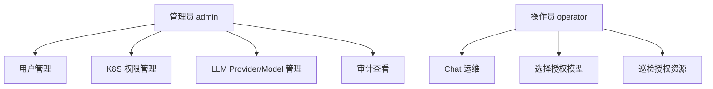

# 业务需求

## 角色定义



## 管理员需求

管理员可以：

- 创建管理员和操作员。
- 禁用或恢复操作员账号。
- 给操作员分配 namespace 级 Kubernetes 权限。
- 通过系统动态创建 ServiceAccount、Role、RoleBinding。
- 配置 OpenAI 和 Anthropic 兼容 Provider。
- 在 Provider 下配置多个模型。
- 给操作员绑定可使用模型，并设置默认模型。
- 查看用户、权限、LLM 配置和 K8S 工具调用审计日志。

## 操作员需求

操作员可以：

- 使用 Keycloak 登录。
- 查看自己可访问的 namespace、resource、verb。
- 查看自己可用的 LLM 模型。
- 通过自然语言 Chat 发起巡检或授权操作。
- 查看 AI 总结、结构化资源表格、日志和 events。

操作员不可以：

- 访问未授权 namespace。
- 操作未授权 resource 或 verb。
- 使用未绑定的 LLM 模型。
- 获取 Kubernetes Secret 明文。
- 获取任何 ServiceAccount token。
- 获得集群级资源权限。

## MVP 功能

### 异常 Pod 巡检

用户输入：

```text
帮我看看现在集群里有什么异常吗？
```

系统行为：

1. Backend 根据 JWT 识别用户。
2. Backend 读取用户可访问 namespace 和 Pod 只读权限。
3. Backend 构造权限受限的 LLM prompt。
4. LLM 请求 `list_pods`、`list_events`、`get_pod_logs` 等工具。
5. Backend 校验工具调用是否在用户权限范围内。
6. MCP Server 使用用户 ServiceAccount 查询 Kubernetes。
7. LLM 汇总异常原因。
8. UI 展示自然语言总结和异常 Pod 明细。

异常状态包含：

- `Failed`
- `Pending`
- `CrashLoopBackOff`
- `ImagePullBackOff`
- `ErrImagePull`

## 非功能需求

### Agent 与多轮上下文

- Backend 必须保存 Chat Session 和 Chat Message，并负责读取、裁剪、脱敏多轮历史。
- Backend 调用 Agent Server 时必须传入 `messages`、`runtimeContext` 和工具 allowlist。
- Agent Server 必须保持无状态，不直接查询或持久化 Chat 历史。
- Backend 与 Agent Server 必须通过 `proto/agent/v1/agent.proto` 生成的 gRPC 契约通信。
- Agent Server 必须使用 Eino 作为 LLM agent 编排边界。

- 文档全部使用中文。
- 程序日志使用英文结构化日志。
- API Key、token、Secret 不得出现在日志和审计中。
- 支持 Helm 部署。
- 支持本地 tar 镜像包和 registry 镜像。
- 支持 PostgreSQL 和 Redis。
- 支持 Keycloak 认证。
- 操作员权限仅限 namespace 级。

## 验收标准

- 管理员可以完成“创建操作员 -> 分配权限 -> 绑定模型”流程。
- 操作员只能看到和操作授权范围内资源。
- 未授权工具调用会被 Backend 拒绝，并写入审计。
- 即使 Backend 校验缺陷，Kubernetes RBAC 也会拒绝越权访问。
- README 可以引导用户找到产品、架构、开发、部署、安全文档。
