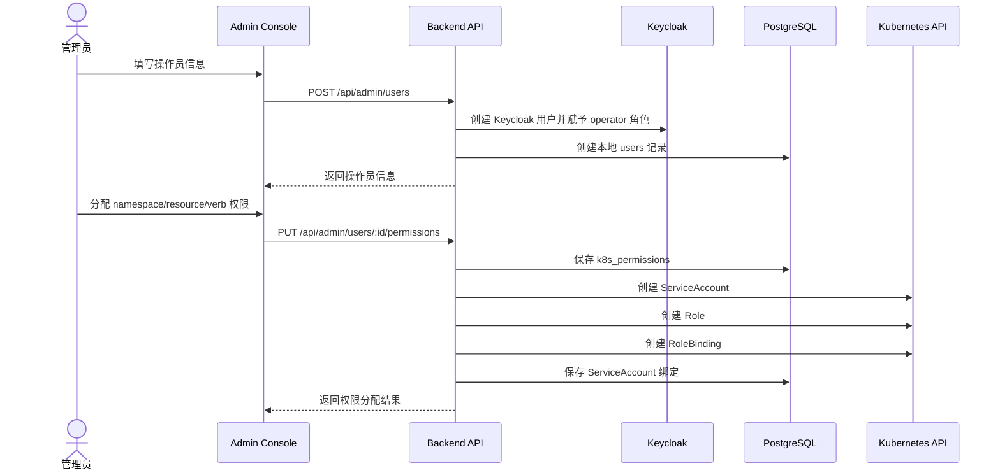
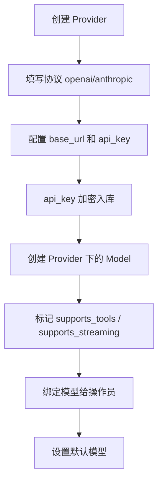
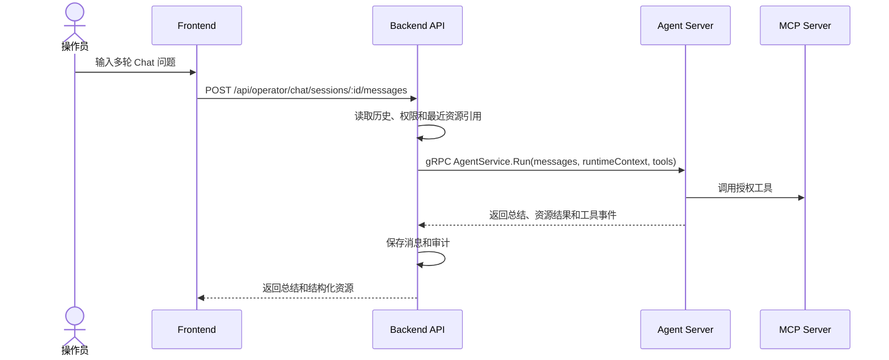
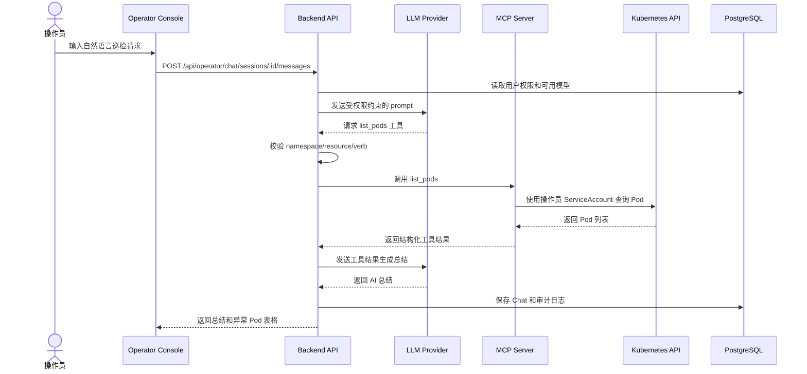
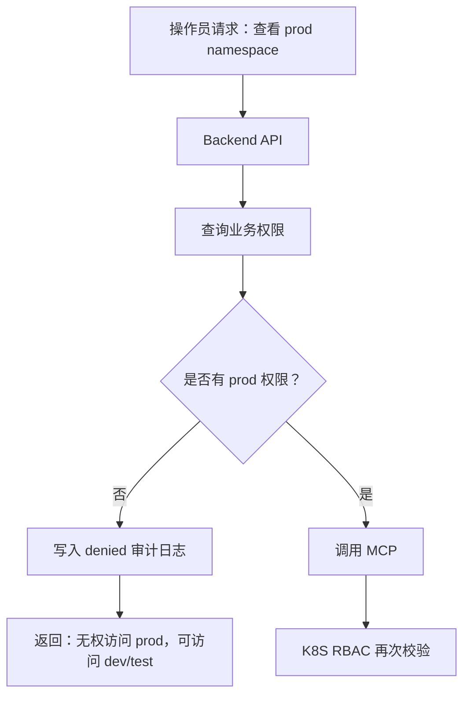

# 用户流程

## 管理员创建操作员

## 管理员配置 LLM

## 操作员 Chat 巡检

当操作员追问“看看这个 Pod 的日志”时，Backend 从最近资源引用中填充 `runtimeContext.recentResources`，Agent Server 用它理解指代，但实际 `get_pod_logs` 仍必须通过工具 allowlist 和 MCP 权限校验。

## 越权请求拦截

