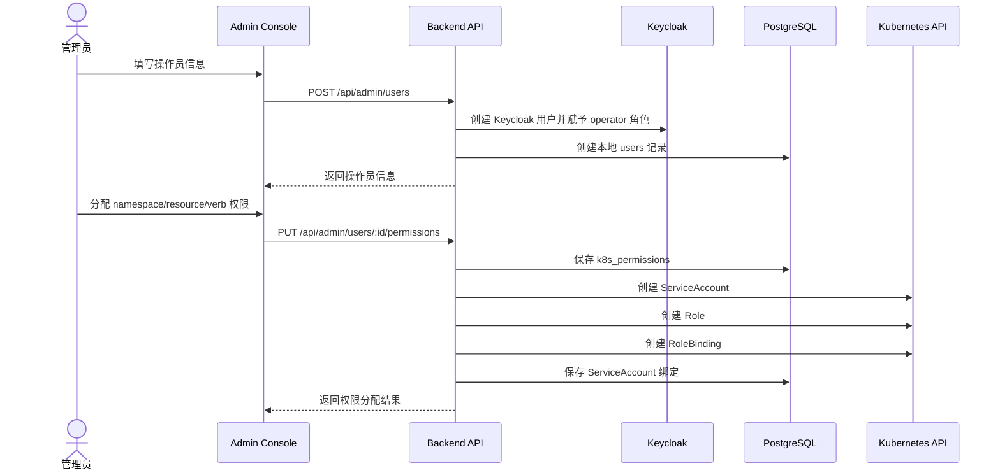
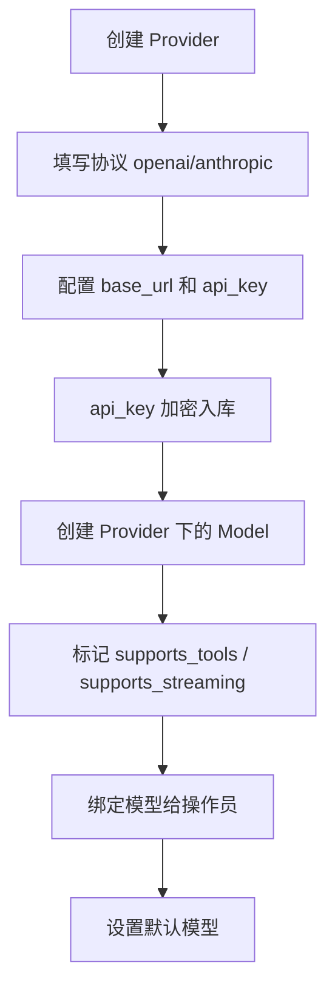
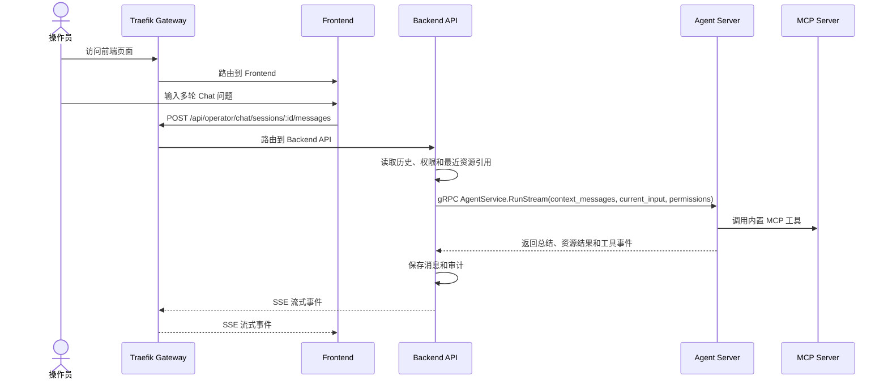
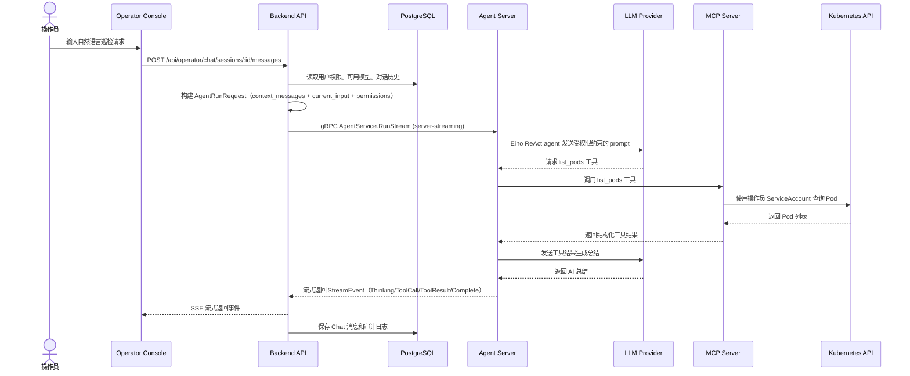
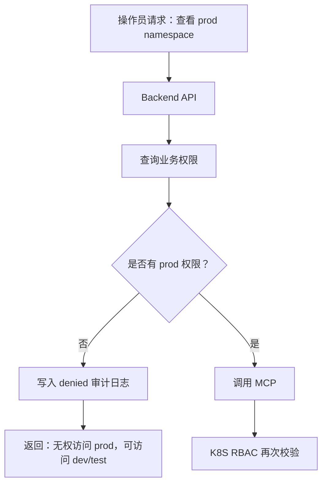

# 用户流程

## 管理员创建操作员

```mermaid
sequenceDiagram
  actor Admin as 管理员
  participant UI as Admin Console
  participant API as Backend API
  participant KC as Keycloak
  participant DB as PostgreSQL
  participant K8S as Kubernetes API

  Admin->>UI: 填写操作员信息
  UI->>API: POST /api/admin/users
  API->>KC: 创建 Keycloak 用户并赋予 operator 角色
  API->>DB: 创建本地 users 记录
  API-->>UI: 返回操作员信息

  Admin->>UI: 分配 namespace/resource/verb 权限
  UI->>API: PUT /api/admin/users/:id/permissions
  API->>DB: 保存 k8s_permissions
  API->>K8S: 创建 ServiceAccount
  API->>K8S: 创建 Role
  API->>K8S: 创建 RoleBinding
  API->>DB: 保存 ServiceAccount 绑定
  API-->>UI: 返回权限分配结果
```

## 管理员配置 LLM

```mermaid
flowchart TD
  A["创建 Provider"] --> B["填写协议 openai/anthropic"]
  B --> C["配置 base_url 和 api_key"]
  C --> D["api_key 加密入库"]
  D --> E["创建 Provider 下的 Model"]
  E --> F["标记 supports_tools / supports_streaming"]
  F --> G["绑定模型给操作员"]
  G --> H["设置默认模型"]
```

## 操作员 Chat 巡检

```mermaid
sequenceDiagram
  actor Operator as 操作员
  participant Traefik as Traefik Gateway
  participant UI as Frontend
  participant API as Backend API
  participant Agent as Agent Server
  participant MCP as MCP Server

  Operator->>Traefik: 访问前端页面
  Traefik->>UI: 路由到 Frontend
  Operator->>UI: 输入多轮 Chat 问题
  UI->>Traefik: POST /api/operator/chat/sessions/:id/messages
  Traefik->>API: 路由到 Backend API
  API->>API: 读取历史、权限和最近资源引用
  API->>Agent: gRPC AgentService.RunStream(context_messages, current_input, permissions)
  Agent->>MCP: 调用内置 MCP 工具
  Agent-->>API: 返回总结、资源结果和工具事件
  API->>API: 保存消息和审计
  API-->>Traefik: SSE 流式事件
  Traefik-->>UI: SSE 流式事件
```

## Chat 巡检详细流程

Backend 通过 gRPC RunStream 委托 Agent Server 执行 ReAct agent loop：

```mermaid
sequenceDiagram
  actor Operator as 操作员
  participant UI as Operator Console
  participant API as Backend API
  participant DB as PostgreSQL
  participant Agent as Agent Server
  participant LLM as LLM Provider
  participant MCP as MCP Server
  participant K8S as Kubernetes API

  Operator->>UI: 输入自然语言巡检请求
  UI->>API: POST /api/operator/chat/sessions/:id/messages
  API->>DB: 读取用户权限、可用模型、对话历史
  API->>API: 构建 AgentRunRequest（context_messages + current_input + permissions）
  API->>Agent: gRPC AgentService.RunStream (server-streaming)
  Agent->>LLM: Eino ReAct agent 发送受权限约束的 prompt
  LLM-->>Agent: 请求 list_pods 工具
  Agent->>MCP: 调用 list_pods 工具
  MCP->>K8S: 使用操作员 ServiceAccount 查询 Pod
  K8S-->>MCP: 返回 Pod 列表
  MCP-->>Agent: 返回结构化工具结果
  Agent->>LLM: 发送工具结果生成总结
  LLM-->>Agent: 返回 AI 总结
  Agent-->>API: 流式返回 StreamEvent（Thinking/ToolCall/ToolResult/Complete）
  API-->>UI: SSE 流式返回事件
  API->>DB: 保存 Chat 消息和审计日志
```

## 越权请求拦截

```mermaid
flowchart TD
  Ask["操作员请求：查看 prod namespace"] --> API["Backend API"]
  API --> Check["查询业务权限"]
  Check --> Deny{"是否有 prod 权限？"}
  Deny -- "否" --> Audit["写入 denied 审计日志"]
  Audit --> Reply["返回：无权访问 prod，可访问 dev/test"]
  Deny -- "是" --> MCP["调用 MCP"]
  MCP --> K8S["K8S RBAC 再次校验"]
```
