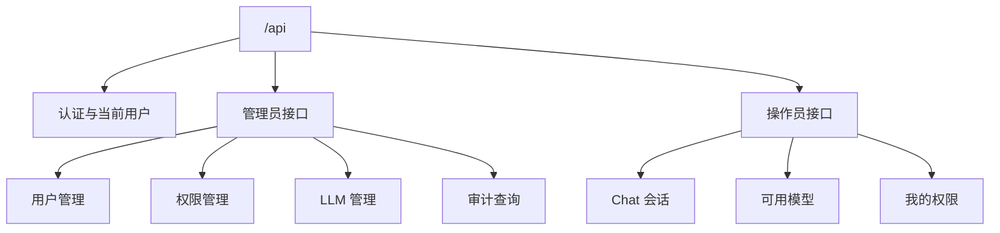

# API 设计

## API 分组



## 认证接口

```text
GET  /api/me
POST /api/auth/sync
```

`GET /api/me` 返回当前登录用户信息和平台角色。

## 管理员用户接口

```text
POST /api/admin/users
GET  /api/admin/users
GET  /api/admin/users/:id
PUT  /api/admin/users/:id/permissions
PUT  /api/admin/users/:id/llm-models
```

权限更新请求：

```json
{
  "permissions": [
    {
      "namespace": "dev",
      "apiGroup": "",
      "resource": "pods",
      "verbs": ["get", "list", "watch"]
    },
    {
      "namespace": "dev",
      "apiGroup": "apps",
      "resource": "deployments",
      "verbs": ["get", "list", "watch", "patch"]
    }
  ]
}
```

## 管理员 LLM 接口

```text
POST /api/admin/llm/providers
GET  /api/admin/llm/providers
POST /api/admin/llm/models
GET  /api/admin/llm/models
```

Provider 请求：

```json
{
  "name": "OpenAI",
  "protocol": "openai",
  "baseUrl": "https://api.openai.com/v1",
  "apiKey": "input-only-plaintext",
  "enabled": true
}
```

说明：

- `apiKey` 只在创建或更新时传入。
- Backend 入库前必须加密。
- 查询接口不得返回明文 `apiKey`。

## 管理员审计接口

```text
GET /api/admin/audit-logs
```

查询参数建议：

```text
actorUserId
action
namespace
resource
allowed
startTime
endTime
page
pageSize
```

当前骨架实现会在以下动作写入内存审计日志：

- `admin.user.create`
- `admin.user.permissions.update`
- `admin.llm.provider.create`
- `admin.llm.model.create`
- `operator.chat.message.create`

## 操作员接口

```text
GET  /api/operator/permissions
GET  /api/operator/llm-models
POST /api/operator/chat/sessions
POST /api/operator/chat/sessions/:id/messages
GET  /api/operator/chat/sessions/:id/events
```

Chat 请求：

```json
{
  "modelId": "model-001",
  "content": "帮我看看现在集群里有什么异常吗？"
}
```

Chat 响应：

```json
{
  "messageId": "msg-002",
  "summary": "dev namespace 中有 2 个异常 Pod，主要原因是镜像拉取失败。",
  "resources": [
    {
      "namespace": "dev",
      "kind": "Pod",
      "name": "api-7b8f9",
      "phase": "Pending",
      "reason": "ImagePullBackOff",
      "message": "Back-off pulling image",
      "restartCount": 0,
      "node": "kind-worker"
    }
  ]
}
```

## 内部 Agent gRPC 契约

Backend API 与 Agent Server 使用 `proto/agent/v1/agent.proto` 生成的 gRPC 代码通信：

```proto
service AgentService {
  rpc Run(AgentRunRequest) returns (AgentRunResponse);
}
```

`AgentRunRequest` 的关键字段：

- `message`：当前用户输入，便于日志摘要和简单调用。
- `messages`：Backend 裁剪后的最近多轮对话上下文。
- `runtimeContext.currentUser`：当前用户展示名。
- `runtimeContext.allowedNamespaces`：当前权限摘要。
- `runtimeContext.recentResources`：最近资源引用，用于多轮指代理解。
- `permissions`：当前用户权限快照。
- `tools`：本轮允许调用的工具 allowlist。

Agent Server 可以使用这些上下文理解问题，但授权结果以 Backend 和 MCP Server 校验为准。

## 错误响应

统一错误结构建议：

```json
{
  "error": {
    "code": "K8S_PERMISSION_DENIED",
    "message": "You do not have permission to list pods in namespace prod.",
    "requestId": "req-001"
  }
}
```

错误码建议：

| 错误码 | 含义 |
| --- | --- |
| `UNAUTHENTICATED` | 未登录或 JWT 无效 |
| `FORBIDDEN` | 平台角色无权访问接口 |
| `K8S_PERMISSION_DENIED` | Kubernetes 业务权限拒绝 |
| `LLM_MODEL_NOT_ALLOWED` | 用户无权使用该模型 |
| `LLM_PROVIDER_UNAVAILABLE` | LLM Provider 不可用 |
| `AGENT_SERVER_UNAVAILABLE` | Backend 无法调用 Agent Server |
| `MCP_TOOL_UNAVAILABLE` | MCP 工具不可用 |
| `K8S_API_ERROR` | Kubernetes API 调用失败 |
| `K8S_RBAC_APPLY_FAILED` | 管理员权限保存后同步 Kubernetes RBAC 失败 |

## 当前实现状态

当前 Backend API 已实现内存版接口、PostgreSQL Store、Redis 连通性检查和 Kubernetes RBAC Manager。权限更新接口在 `K8S_RBAC_SYNC_ENABLED=true` 时会同步 namespace 级 ServiceAccount、Role、RoleBinding。尚未接入真实 Keycloak、MCP Client 和 LLM Provider。

后续接入真实组件时，应保持本文件中的接口路径、字段名和错误结构不变。
