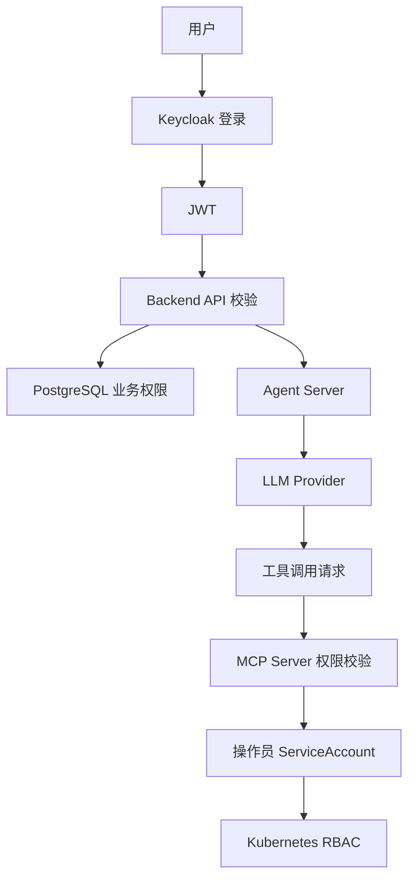

# 安全设计

## Agent 与 LLM 安全边界

引入 Agent Server 后，LLM 安全边界如下：

- Backend 负责筛选 `context_messages`，并传入当前用户当前会话可见的最小必要上下文
- Agent Server 使用 Eino 执行推理，但不保存历史、不保存权限、不写审计库
- Agent Server 只能使用内置 MCP Server 暴露的工具；每次工具执行前必须通过 MCP Server 权限校验
- 日志不得输出 LLM API Key、ServiceAccount token、Kubernetes Secret、用户密码或完整敏感工具结果

## 安全目标

- 身份认证由 Keycloak 统一负责
- 操作员只能操作管理员分配的 namespace 级资源
- LLM 不直接接触 Kubernetes 凭据
- Kubernetes RBAC 是最终权限边界
- 敏感信息不出现在日志、审计和前端响应中

## 安全架构

## 认证

Backend 必须校验：

- issuer
- audience
- signature
- expiration
- role claims

Keycloak JWKS 可以缓存在 Redis 中，但 Redis 不是最终身份源。

## 授权

**平台角色**：

- `admin`：可访问管理接口
- `operator`：可访问操作员 Chat 接口

**业务权限**：namespace + apiGroup + resource + verbs

**Kubernetes 权限**：

- 操作员使用 namespace 级 ServiceAccount
- 系统不为操作员创建 ClusterRoleBinding
- Backend 控制面权限仅用于管理 namespace 级 RBAC

## LLM 安全

- LLM prompt 只包含权限摘要，不包含凭据
- 操作员只能查看和使用自己绑定的 LLM 模型
- Backend 调用 Agent Server 前必须校验 Chat 会话归属，避免跨用户会话访问
- LLM tool call 不可信，MCP Server 执行前必须校验
- LLM API Key 加密保存（AES-256-GCM，密钥由 `ENCRYPTION_KEY` 环境变量派生）
- ServiceAccount token 加密保存
- 不允许 LLM 直接访问 Kubernetes API
- 不允许 LLM 返回 Secret 明文

## 审计安全

审计日志应记录：

- actor、action、target、namespace、resource、verb、allowed、reason
- sanitized request、sanitized response

审计日志不得记录：

- 明文 API Key、明文 token、Secret 内容、用户密码

## 威胁和控制

| 威胁 | 控制措施 |
|------|----------|
| 操作员越权访问 namespace | MCP Server 业务校验 + K8s RBAC |
| LLM 生成越权工具参数 | MCP Server 工具执行前授权校验 |
| API Key 泄露 | AES-256-GCM 加密存储，不写日志 |
| 前端伪造角色 | Backend 校验 Keycloak JWT |
| Backend 权限过大 | `rbac.managedNamespaces` 白名单 + 审计 |
| 日志泄露敏感数据 | 日志脱敏规则和审计脱敏 |
| 未授权访问 Traefik 路由 | Traefik 仅暴露 HTTP 入口，gRPC/SSE 走内部 ClusterIP |
