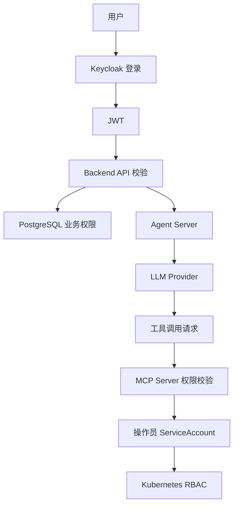

# 安全设计

## Agent 与 LLM 安全边界

引入 Agent Server 后，LLM 安全边界如下：

- Backend 负责筛选 `context_messages`，并传入当前用户当前会话可见的最小必要上下文。
- Agent Server 使用 Eino 执行推理，但不保存历史、不保存权限、不写审计库。
- Agent Server 只能使用内置 MCP Server 暴露的工具；每次工具执行前必须通过 MCP Server 权限校验。
- 日志不得输出 LLM API Key、ServiceAccount token、Kubernetes Secret、用户密码或完整敏感工具结果。

## 安全目标

- 身份认证由 Keycloak 统一负责。
- 操作员只能操作管理员分配的 namespace 级资源。
- LLM 不直接接触 Kubernetes 凭据。
- Kubernetes RBAC 是最终权限边界。
- 敏感信息不出现在日志、审计和前端响应中。

## 安全架构

## 认证

Backend 必须校验：

- issuer
- audience
- signature
- expiration
- role claims

Keycloak JWKS 可以缓存在 Redis 中，但 Redis 不是最终身份源。

## 授权

平台角色：

- `admin`：可访问管理接口。
- `operator`：可访问操作员 Chat 接口。

业务权限：

- namespace
- apiGroup
- resource
- verbs

Kubernetes 权限：

- 操作员使用 namespace 级 ServiceAccount。
- 系统不为操作员创建 ClusterRoleBinding。
- Backend 控制面权限仅用于管理 namespace 级 RBAC。

## LLM 安全

- LLM prompt 只包含权限摘要，不包含凭据。
- 操作员只能查看和使用自己绑定的 LLM 模型。
- Backend 调用 Agent Server 前必须校验 Chat 会话归属，避免跨用户会话访问。
- LLM tool call 不可信，MCP Server 执行前必须校验。
- LLM API Key 加密保存。
- ServiceAccount token 加密保存，IdentityService 只在 gRPC 响应中返回当前用户绑定凭据。
- 不允许 LLM 直接访问 Kubernetes API。
- 不允许 LLM 返回 Secret 明文。

## 审计安全

审计日志应记录：

- actor
- action
- target
- namespace
- resource
- verb
- allowed
- reason
- sanitized request
- sanitized response

审计日志不得记录：

- 明文 API Key
- 明文 token
- Secret 内容
- 用户密码

## 威胁和控制

| 威胁 | 控制措施 |
| --- | --- |
| 操作员越权访问 namespace | MCP Server 业务校验 + K8S RBAC |
| LLM 生成越权工具参数 | MCP Server 工具执行前授权校验 |
| API Key 泄露 | 加密存储，不写日志 |
| 前端伪造角色 | Backend 校验 Keycloak JWT |
| Backend 权限过大 | 审计、namespace 白名单扩展、最小权限优化 |
| 日志泄露敏感数据 | 日志脱敏规则和审计脱敏 |

## 当前实现状态

当前安全措施已实现：

- **MCP Server 工具执行前校验**：每次工具调用前校验 namespace/resource/verb 是否在用户业务权限范围内。
- **Kubernetes RBAC 兜底**：MCP Server 通过 IdentityService gRPC 获取操作员 ServiceAccount，构建 per-user K8s client，确保即使上层校验有缺陷，Kubernetes RBAC 仍会拒绝越权访问。
- **无状态 Agent Server**：Agent Server 不保存历史、不保存权限、不写审计库，只使用 Backend 传入的权限上下文和内置 MCP 工具。
- **敏感配置加密**：Backend 使用 `ENCRYPTION_KEY` 派生 AES-256-GCM 密钥，加密保存 LLM API Key 和 ServiceAccount token。未配置 `ENCRYPTION_KEY` 时仅用于本地开发，会退回明文存储。
- **结构化 JSON 日志**：所有服务使用 logrus 输出 JSON 格式日志，日志中不包含 LLM API Key、ServiceAccount token、Kubernetes Secret 明文、用户密码。
- **审计日志**：Backend 对管理员操作和操作员 Chat 写入审计记录，含脱敏后的请求和响应。
- **Helm 安全**：RBAC Manager 只在 Helm Chart 声明的 `rbac.managedNamespaces` 范围内操作，不创建 ClusterRoleBinding。

尚未实现：

- **Keycloak JWT audience 校验**：当前 JWT 模式已校验 issuer、signature 和 expiration，尚未显式校验 audience。
- **Redis 安全**：Redis 连接当前无 TLS/认证（用于开发环境），生产环境需要补充。
