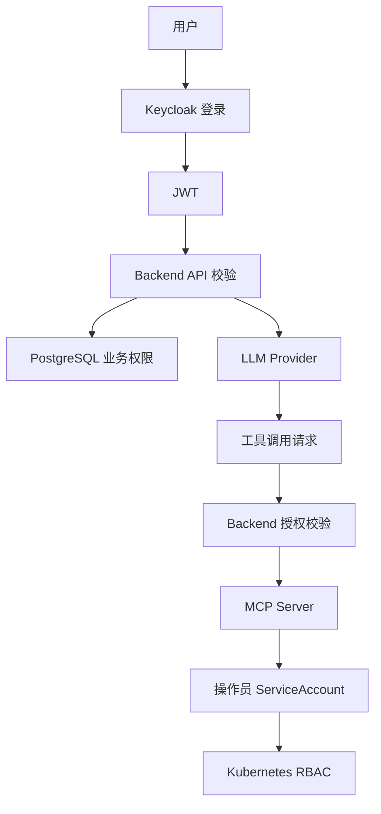

# 安全设计

## Agent 与 LLM 安全边界

引入 Agent Server 后，LLM 安全边界如下：

- Backend 负责筛选 `messages` 和 `runtimeContext`，只传入当前用户当前会话可见的最小必要上下文。
- Agent Server 使用 Eino 执行推理，但不保存历史、不保存权限、不写审计库。
- `runtimeContext.recentResources` 只帮助 LLM 理解“这个 Pod”等指代，不能作为授权依据。
- 工具调用必须同时通过 Backend 生成的 allowlist 和 MCP Server 的权限校验。
- 日志不得输出 LLM API Key、ServiceAccount token、Kubernetes Secret、用户密码或完整敏感工具结果。

## 安全目标

- 身份认证由 Keycloak 统一负责。
- 操作员只能操作管理员分配的 namespace 级资源。
- LLM 不直接接触 Kubernetes 凭据。
- Kubernetes RBAC 是最终权限边界。
- 敏感信息不出现在日志、审计和前端响应中。

## 安全架构

## 认证

Backend 必须校验：

- issuer
- audience
- signature
- expiration
- role claims

Keycloak JWKS 可以缓存在 Redis 中，但 Redis 不是最终身份源。

## 授权

平台角色：

- `admin`：可访问管理接口。
- `operator`：可访问操作员 Chat 接口。

业务权限：

- namespace
- apiGroup
- resource
- verbs

Kubernetes 权限：

- 操作员使用 namespace 级 ServiceAccount。
- 系统不为操作员创建 ClusterRoleBinding。
- Backend 控制面权限仅用于管理 namespace 级 RBAC。

## LLM 安全

- LLM prompt 只包含权限摘要，不包含凭据。
- LLM tool call 不可信，必须校验。
- LLM API Key 加密保存。
- 不允许 LLM 直接访问 Kubernetes API。
- 不允许 LLM 返回 Secret 明文。

## 审计安全

审计日志应记录：

- actor
- action
- target
- namespace
- resource
- verb
- allowed
- reason
- sanitized request
- sanitized response

审计日志不得记录：

- 明文 API Key
- 明文 token
- Secret 内容
- 用户密码

## 威胁和控制

| 威胁 | 控制措施 |
| --- | --- |
| 操作员越权访问 namespace | Backend 业务校验 + K8S RBAC |
| LLM 生成越权工具参数 | 工具调用前授权校验 |
| API Key 泄露 | 加密存储，不写日志 |
| 前端伪造角色 | Backend 校验 Keycloak JWT |
| Backend 权限过大 | 审计、namespace 白名单扩展、最小权限优化 |
| 日志泄露敏感数据 | 日志脱敏规则和审计脱敏 |
