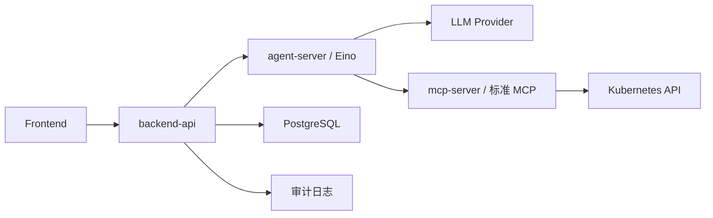

# Eino Agent 与 MCP 服务拆分设计

## 背景

当前项目的 Chat、LLM 和 MCP 集成仍处于骨架阶段：

- `backend-api` 已提供用户、权限、LLM 配置、Chat API 和审计入口。
- `backend/internal/chat` 已包含 prompt 构造和工具权限校验的基础模型。
- `backend/internal/llm` 已包含 provider、model、tool call 的轻量抽象。
- `mcp-server` 目前是自定义 HTTP 工具服务 stub，还不是标准 MCP 服务。
- Chat 消息接口当前返回固定巡检结果，尚未接入真实 LLM agent loop。

本设计目标是一次性重构为 `backend-api + agent-server + 标准 MCP server` 三服务架构，引入 Eino 作为 Go agent 编排框架，并同步更新所有受影响文档。

## 目标

1. 新增独立 `agent-server` 服务，使用 Eino 承接 LLM 编排、tool calling 和 MCP client 调用。
2. 将 `mcp-server` 从自定义 HTTP stub 演进为标准 MCP 工具服务。
3. 保留 `backend-api` 作为前端唯一入口，继续负责认证、权限、模型配置、会话、审计和安全闸口。
4. 建立稳定的内部 DTO，避免 Eino 类型泄漏到前端 API 或 `backend-api` 外部契约。
5. 支持多轮对话上下文：`backend-api` 管理会话历史，`agent-server` 只消费本轮请求携带的最小必要上下文。
6. 同步更新 `docs/` 下所有受影响文档，确保需求、架构、API、部署、安全和运维说明与代码一致。

## 非目标

1. 不在本阶段实现复杂长期记忆、任务队列、定时巡检或多 agent 协作。
2. 不让 `agent-server` 直接管理用户、权限、模型配置或审计落库。
3. 不让 LLM 或前端传入的角色声明成为 Kubernetes 授权依据。
4. 不把 Eino 作为跨服务 API 类型暴露给前端或其他服务。
5. 不让 `agent-server` 直接查询或持久化 Chat 历史；历史读取、裁剪、脱敏和保存由 `backend-api` 负责。

## 总体架构



### `backend-api`

`backend-api` 保留为前端唯一 HTTP API，承担以下职责：

- 认证当前用户并加载用户业务权限。
- 管理 LLM Provider、模型绑定和默认模型选择。
- 创建 Chat Session 和 Chat Message。
- 根据当前用户权限生成工具 allowlist。
- 读取当前 Chat Session 的历史消息，按策略裁剪和脱敏后传给 `agent-server`。
- 维护最近资源引用，例如上一轮返回的 Pod、Deployment、Event，用于支持“这个 Pod”“刚才那个 Deployment”等多轮指代。
- 调用 `agent-server` 执行一次 Chat Run。
- 记录 Chat 消息、LLM 请求摘要、工具调用事件、允许或拒绝访问事件。
- 在模型未绑定、工具越权、agent 服务不可用时返回结构化错误。

`backend-api` 不直接执行 Eino agent loop，也不直接访问 Kubernetes 业务资源。

### `agent-server`

`agent-server` 是新的 Go 服务，内部使用 Eino 组织 agent loop：

- 接收 `backend-api` 传入的 `AgentRunRequest`。
- 根据模型运行配置构造 Eino `ChatModel`。
- 根据工具 allowlist 注册 MCP-backed tools。
- 构造系统提示词，包含用户身份、授权范围、最近对话、最近资源引用、可用工具和输出格式。
- 调用 LLM，处理 tool call，调用 MCP client，回填工具结果。
- 返回最终自然语言总结、结构化资源结果和工具调用事件列表。

`agent-server` 不保存用户权限，不落审计库，不自行扩大工具范围，也不持久化 Chat 历史。多轮对话能力通过 `backend-api` 在每次请求中传入 `messages` 和 `runtimeContext` 实现。

### `mcp-server`

`mcp-server` 改为标准 MCP 工具服务，负责 Kubernetes 工具能力：

- `list_namespaces`
- `list_pods`
- `get_pod`
- `get_pod_logs`
- `list_events`
- `list_deployments`
- `restart_deployment`

每个工具必须声明资源、verb 和参数 schema。执行前必须校验请求中的授权上下文，执行时必须使用当前用户绑定的 ServiceAccount 调用 Kubernetes API。

## 内部接口

### `AgentRunRequest`

`backend-api` 调用 `agent-server` 时使用稳定 DTO：

```json
{
  "requestId": "req-demo",
  "sessionId": "demo-session",
  "messageId": "demo-message",
  "user": {
    "id": "demo-user",
    "username": "operator-a"
  },
  "model": {
    "providerId": "provider-openai",
    "protocol": "openai",
    "baseUrl": "https://api.openai.com/v1",
    "apiKey": "runtime-secret",
    "modelName": "gpt-4.1",
    "supportsTools": true,
    "supportsStreaming": true
  },
  "messages": [
    {
      "role": "user",
      "content": "帮我看看 dev namespace 里有什么异常"
    },
    {
      "role": "assistant",
      "content": "dev namespace 中有 1 个异常 Pod api-7b8f9。"
    },
    {
      "role": "user",
      "content": "看看这个 Pod 的日志"
    }
  ],
  "message": "看看这个 Pod 的日志",
  "permissions": [
    {
      "namespace": "dev",
      "apiGroup": "",
      "resource": "pods",
      "verbs": ["get", "list"]
    }
  ],
  "tools": [
    {
      "name": "list_pods",
      "namespace": "dev",
      "apiGroup": "",
      "resource": "pods",
      "verb": "list"
    }
  ],
  "runtimeContext": {
    "currentUser": "operator-a",
    "allowedNamespaces": ["dev"],
    "recentResources": [
      {
        "kind": "Pod",
        "namespace": "dev",
        "name": "api-7b8f9"
      }
    ]
  }
}
```

`messages` 表示传给 agent 的最近对话上下文，由 `backend-api` 负责裁剪、脱敏和排序。`message` 保留为当前用户输入，便于简单调用和日志摘要。`runtimeContext` 表示非自然语言上下文，包括当前用户、授权 namespace 和最近资源引用。`agent-server` 可以使用这些上下文理解多轮指代，但不能把它们当作授权依据。

### `AgentRunResponse`

```json
{
  "summary": "dev namespace 中有 2 个异常 Pod。",
  "resources": [
    {
      "kind": "Pod",
      "namespace": "dev",
      "name": "api-7b8f9",
      "status": "ImagePullBackOff"
    }
  ],
  "toolEvents": [
    {
      "toolName": "list_pods",
      "namespace": "dev",
      "resource": "pods",
      "verb": "list",
      "allowed": true,
      "reason": "tool completed"
    }
  ]
}
```

`apiKey` 仅在服务间运行时传递，不写日志、不写审计明文、不返回前端。后续可替换为密钥引用或服务端凭证查询。

## 权限和审计

权限校验采用两层防护：

1. `backend-api` 根据当前用户真实业务权限生成工具 allowlist，并拒绝未授权模型和明显越权工具范围；同时筛选多轮历史，只传入当前用户当前会话可见的最小必要上下文。
2. `mcp-server` 在每次工具执行前再次校验 namespace、resource、verb，并使用当前用户绑定的 ServiceAccount 访问 Kubernetes。

审计由 `backend-api` 统一写入：

- 管理员 LLM 配置变更。
- Chat 消息创建。
- LLM 调用请求摘要。
- 每次工具调用的允许、拒绝和失败事件。
- Kubernetes RBAC 拒绝事件。

日志继续使用英文，避免输出 LLM API Key、ServiceAccount token、Kubernetes Secret、用户密码和完整敏感资源内容。

## 错误处理

- 模型未绑定：`backend-api` 返回 `LLM_MODEL_NOT_ALLOWED`，不调用 `agent-server`。
- `agent-server` 不可用：`backend-api` 返回 `AGENT_SERVER_UNAVAILABLE`，写失败审计。
- LLM Provider 不可用：`agent-server` 返回结构化错误，`backend-api` 转换为 `LLM_PROVIDER_UNAVAILABLE`。
- 工具越权：`mcp-server` 返回拒绝结果，`agent-server` 不重试越权调用，`backend-api` 写 denied 审计。
- Kubernetes RBAC 拒绝：`mcp-server` 返回 `K8S_RBAC_DENIED`，响应中不包含敏感细节。
- 日志过大：`get_pod_logs` 默认只读取 tail 行数，并在结果中标记截断。

## 部署设计

Helm 新增 `agentServer` 配置：

```yaml
agentServer:
  replicas: 1
  image:
    repository: k8s-ai-agent-server
  service:
    port: 8082
```

环境变量调整：

- `backend-api`
  - `AGENT_SERVER_URL=http://agent-server:8082`
  - 保留 `MCP_SERVER_URL` 作为迁移期兼容项，最终由 `agent-server` 使用。
- `agent-server`
  - `HTTP_ADDR=:8082`
  - `MCP_SERVER_URL=http://mcp-server:8081`
- `mcp-server`
  - `HTTP_ADDR=:8081`

构建脚本输出新增：

```text
image-tars/agent-server-amd64.tar
```

## 测试策略

### `backend-api`

- Chat 消息使用已授权模型时调用 `agent-server`。
- Chat 消息使用未授权模型时返回 `LLM_MODEL_NOT_ALLOWED`，且不调用 `agent-server`。
- `agent-server` 返回工具事件时，`backend-api` 写入对应审计日志。
- `agent-server` 不可用时返回结构化错误并写失败审计。

### `agent-server`

- 使用 mock LLM 和 mock MCP 验证一次 tool call 到最终回答的 agent loop。
- 验证 `messages` 和 `runtimeContext.recentResources` 可以用于解析多轮指代。
- 验证 Eino 类型不会出现在公共 DTO。
- 验证工具 allowlist 为空时不会注册 Kubernetes 工具。
- 验证 LLM 请求失败会返回结构化错误。

### `mcp-server`

- 每个工具覆盖参数校验、权限校验和成功路径。
- `get_pod_logs` 覆盖 tail 行数和截断标记。
- `restart_deployment` 覆盖 patch 权限和拒绝路径。

### 部署

- Helm 模板渲染包含 `agent-server` Deployment 和 Service。
- `backend-api` 注入 `AGENT_SERVER_URL`。
- `agent-server` 注入 `MCP_SERVER_URL`。
- 构建脚本包含新增镜像和 tar 输出。

## 文档同步范围

本次实现必须同步更新以下文档：

- `README.md`：更新服务列表、快速开始、验证命令、部署命令和镜像产物。
- `ARCHITECTURE.md`：更新三服务架构摘要和企业级架构入口。
- `AI_PROMPTS.md`：记录本次 AI 协同研发决策。
- `docs/INDEX.md`：更新架构、开发、运维、安全阅读路径说明。
- `docs/product/overview.md`：说明 Eino agent 与 MCP 工具能力边界。
- `docs/product/requirements.md`：更新 LLM 管理、MCP 工具、审计和权限需求。
- `docs/product/user-journeys.md`：更新操作员 Chat 巡检和管理员配置流程。
- `docs/architecture/system-architecture.md`：更新组件拓扑、部署拓扑和服务职责。
- `docs/architecture/permission-model.md`：更新 backend、agent、MCP 三层授权边界。
- `docs/architecture/chat-mcp-flow.md`：更新 Eino agent loop 和标准 MCP 调用链路。
- `docs/architecture/data-model.md`：更新 Chat 消息历史、最近资源引用、审计、LLM 配置模型说明。
- `docs/developer/developer-guide.md`：更新目录结构、agent-server 开发方式、测试命令。
- `docs/operations/deployment-guide.md`：更新 Helm values、镜像、端口、环境变量、部署命令。
- `docs/operations/observability-and-troubleshooting.md`：更新 agent-server 日志、审计事件和排错路径。
- `docs/operations/public-cloud-test-plan.md`：更新公有云测试服务列表和验证步骤。
- `docs/security/security-design.md`：更新 LLM、agent、MCP、K8S 工具调用安全边界。
- `docs/reference/api-design.md`：更新 Chat API、错误码和内部 agent 调用契约说明。
- `docs/reference/glossary.md`：补充 Eino、Agent Server、MCP Tool、Tool Allowlist 等术语。

所有新增或修改的 Markdown 文档必须使用中文。

## 迁移步骤

1. 新增 `agent-server` Go module、Dockerfile、健康检查和 Helm 模板。
2. 在 `agent-server` 中定义内部 DTO、Eino runner 接口和 mock runner 测试。
3. 将 `backend-api` Chat 消息处理改为调用 `agent-server`，保留模型授权和审计。
4. 在 `backend-api` 中为 `AgentRunRequest` 组装最近对话历史和最近资源引用。
5. 将 `mcp-server` 工具定义改造为标准 MCP 风格，保留 Kubernetes 工具测试。
6. 接入 Eino ChatModel 和 MCP-backed tools。
7. 更新构建脚本、Helm values 和部署文档。
8. 更新全部受影响文档。
9. 运行后端、agent、MCP 单元测试和 Helm 模板验证。

## 验收标准

1. `backend-api`、`agent-server`、`mcp-server` 三个服务均有 `/healthz` 或等价健康检查。
2. Chat 消息请求通过 `backend-api` 调用 `agent-server`，不再直接返回固定巡检结果。
3. `backend-api` 负责保存和组装多轮历史，`agent-server` 无状态消费 `messages` 和 `runtimeContext`。
4. `agent-server` 内部使用 Eino 完成至少一个 mock tool calling 流程测试。
5. `mcp-server` 暴露标准 MCP 工具定义，并覆盖权限拒绝测试。
6. 未授权模型、越权工具调用、agent 不可用和 MCP 不可用均返回结构化错误。
7. 工具调用、拒绝访问、LLM 配置变更和 Chat 消息均写审计。
8. Helm values、模板、构建脚本包含 `agent-server`。
9. `docs/` 与根目录文档中所有受影响内容均已同步为中文说明。
